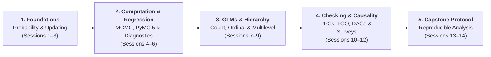

# Bayesian Analysis of Empirical Data: Course Overview

## Introduction

Welcome to **Bayesian Analysis of Empirical Data** (*Байесовский анализ эмпирических данных*). This course equips students and researchers with theoretical foundations and computational tools to model uncertainty, structure hierarchical data, and make principled inferences from empirical data across the social, cognitive, and behavioural sciences.

The course moves from the foundational principles of probability and Bayesian updating to applied generalized linear models, multilevel hierarchies, computational diagnostics, causal DAGs, survey inference, and reproducible research protocols.



---

## 🚀 Interactive Learning Platform: Colab & Streamlit

To make learning active, intuitive, and accessible without complex local installations:

1. **Google Colab Integration**:
   - Every chapter and computational notebook in this book features an official **"Open in Colab"** launch button at the top.
   - Run Python code, fit **PyMC 5** models, and compute **ArviZ** diagnostics directly in the cloud using free Google CPU/GPU compute.

2. **Interactive Streamlit Web Demonstrations**:
   - Instant parameter exploration and step-by-step visual intuition without writing code.
   - 🎯 **[Module 1: Prior $\to$ Likelihood $\to$ Posterior Explorer](https://share.streamlit.io)** — Beta-Binomial conjugate updating, 95% HDI, sequential data arrival, and prior sensitivity analysis.
   - 🔄 **[Module 2: MCMC & Metropolis-Hastings Simulator](https://share.streamlit.io)** — Interactive proposal tuning ($\sigma_{\text{prop}}$), step-by-step accept/reject decisions, live traceplots, autocorrelation, and $\hat{R}$ / ESS diagnostics.
   - 🌲 **[Module 3: Partial Pooling & Shrinkage Visualizer](https://share.streamlit.io)** — Multilevel shrinkage dynamics across varying group sample sizes ($n_j$).

---

## 14-Session Curriculum Map

The course comprises **14 sessions (56 contact academic hours)**:

| Part | Session | Topic & Focus | Computational / Interactive Lab |
|:---|:---:|:---|:---|
| **Part I: Foundations** | 1 | **Research Questions & Estimands**<br>Constructs, indicators, units of analysis, sample vs. population. | Measurement error and noise simulation |
| | 2 | **Bayes' Theorem & Distributions**<br>Conditional probability, likelihood functions, and sequential updating. | Base-rate explorer & probability tree |
| | 3 | **Priors & Conjugate Models**<br>Informative, weakly informative, and skeptical priors; Beta-Binomial updating. | Prior-Likelihood-Posterior interactive dashboard |
| **Part II: Computation** | 4 | **Monte Carlo & MCMC Algorithms**<br>Markov chains, Metropolis-Hastings, Gibbs sampling, and HMC/NUTS. | Step-by-step MCMC visual sampler |
| | 5 | **Linear Regression in PyMC**<br>Priors on coefficients, standardization, expected values vs. new observations. | PyMC linear regression with predictions |
| | 6 | **Convergence Diagnostics & Gate**<br>Rank-normalized $\hat{R}$, bulk/tail ESS, divergences, and traceplots. | Diagnostic failure and recovery clinic |
| **Part III: Applied Models** | 7 | **Robust Models & Outliers**<br>Normal vs. Student-$t$ likelihoods, scale parameters, and heavy tails. | Outlier impact comparison |
| | 8 | **Interactions & Conditional Predictions**<br>Moderation, categorical predictors, and marginal contrasts. | Interaction response surface explorer |
| | 9 | **Generalized Linear Models (GLMs)**<br>Logistic regression for binary choices, Poisson/Negative-Binomial for counts, and Ordinal logit. | Inverse link probability transforms |
| **Part IV: Hierarchies** | 10 | **Multilevel Models & Partial Pooling**<br>Exchangeability, varying intercepts/slopes, and shrinkage. | Interactive shrinkage simulator |
| | 11 | **Model Checking & Comparison**<br>Prior/posterior predictive checks (PPC), Pareto-$k$, and LOO cross-validation. | PPC discrepancies vs. LOO benchmark |
| **Part V: Synthesis** | 12 | **Causal Inference & DAGs**<br>Potential outcomes, confounding, colliders, and mediator adjustment. | Causal DAG adjustment simulator |
| | 13 | **Missing Data & Poststratification**<br>Nonresponse (MCAR/MAR/MNAR), imputation, and survey weighting. | Poststratification & selection adjustments |
| | 14 | **Reproducible Research Protocol**<br>Complete empirical protocol, data audits, model cards, and project defence. | Guided research protocol builder |

---

## Software Environment

- **Python 3.12**
- **PyMC 5** (Modern probabilistic programming)
- **ArviZ** (Exploratory analysis of Bayesian models)
- **Bambi** (High-level Bayesian formula interface)
- **Streamlit** & **Plotly** (Interactive visual tools)

## Core Literature & Citations

- **Kruschke, J. K. (2015).** *Doing Bayesian Data Analysis: A Tutorial with R, JAGS, and Stan.* Academic Press. {cite}`kruschke2015doing`
- **McElreath, R. (2020).** *Statistical Rethinking: A Bayesian Course with Examples in R and Stan.* CRC Press. {cite}`mcelreath2020statistical`
- **Gelman, A., Hill, J., & Vehtari, A. (2021).** *Regression and Other Stories.* Cambridge University Press. {cite}`gelman2021regression`
- **Jackman, S. (2009).** *Bayesian Analysis for the Social Sciences.* John Wiley & Sons. {cite}`jackman2009bayesian`
- **Maier, M., Bartoš, F., & Wagenmakers, E.-J. (2025).** *Model-averaged Bayesian t tests.* Behavior Research Methods. {cite}`maier2025model`

---

## References

```{bibliography}
:filter: docname in docnames
```
