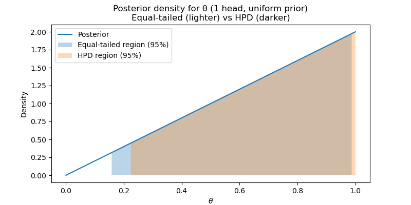

# Bayesian Inference


## Bayesian Approach to Estimating Coin Bias

The Bayesian approach allows us to incorporate prior information into our analysis, which is difficult under the frequentist paradigm. For example, if you're dealing with a familiar scenario, like estimating the bias of a coin presented by your brother, you might already have some beliefs about the situation before seeing any data.

Suppose you believe there's a 60% probability that the coin is loaded before you even flip it. This prior knowledge is captured as a **prior probability**:

$$
P(\text{loaded}) = 0.6
$$

Using Bayes' theorem, we can update this prior with observed data to form the **posterior probability**.

```{important}
**Bayes' theorem (discrete version):**

$$
f(\theta \mid x) = \frac{f(x \mid \theta) \cdot f(\theta)}{\sum_{\theta} f(x \mid \theta) \cdot f(\theta)}
$$

Where:

- $f(\theta \mid x)$ is the **posterior probability** of $\theta$ given data $x$.
- $f(x \mid \theta)$ is the **likelihood** of observing data $x$ given $\theta$.
- $f(\theta)$ is the **prior probability** of $\theta$.
- The denominator is a **normalizing constant** to ensure the probabilities sum to one.
```

## Example: Estimating a Coin's Bias

Let's apply Bayes' theorem to our coin scenario, where the coin can either be fair ($\theta = 0.5$) or loaded ($\theta = 0.7$). We observe 5 coin flips and get 2 heads ($x = 2$).

### Likelihood Calculations

The likelihood of the data given each hypothesis is:

- **Fair Coin ($\theta = 0.5$):**

$$
f(x \mid \theta = 0.5) = \binom{5}{2} (0.5)^2 (0.5)^{3} = 10 \times (0.5)^5 = 0.3125
$$

- **Loaded Coin ($\theta = 0.7$):**

$$
f(x \mid \theta = 0.7) = \binom{5}{2} (0.7)^2 (0.3)^{3} = 10 \times 0.0132 = 0.1323
$$

### Prior Probabilities

Given the prior belief:

- $P(\text{fair}) = 0.4$
- $P(\text{loaded}) = 0.6$

### Posterior Calculation

Using Bayes' theorem, the posterior probabilities are:

$$
P(\text{fair} \mid x = 2) = \frac{0.3125 \times 0.4}{0.3125 \times 0.4 + 0.1323 \times 0.6} = \frac{0.125}{0.125 + 0.0794} \approx 0.612
$$

$$
P(\text{loaded} \mid x = 2) = \frac{0.1323 \times 0.6}{0.3125 \times 0.4 + 0.1323 \times 0.6} = \frac{0.0794}{0.125 + 0.0794} \approx 0.388
$$

After observing only 2 heads in 5 flips, the data favors the fair coin — the posterior probability that the coin is fair increased from 0.40 to 0.61. This makes intuitive sense: 2 heads in 5 flips is close to the expected value under fairness (2.5) but far from the loaded coin's expectation (3.5).

```{admonition} Cognitive Science Example
:class: tip
**Is a patient's memory impaired?** A neuropsychologist evaluates whether a patient has a memory deficit. Before testing, there are two hypotheses:

- $\theta = \text{impaired}$: the patient has a memory deficit
- $\theta = \text{normal}$: the patient's memory is within normal range

**Prior:** $P(\text{impaired}) = 0.3$ (based on the referral information and base rates).

The patient completes a word list learning test with 10 items. From normative data:
- Under the impaired model: $P(\text{recall} \leq 4 \mid \text{impaired}) = 0.75$
- Under the normal model: $P(\text{recall} \leq 4 \mid \text{normal}) = 0.10$

The patient recalls only 3 words. Applying Bayes' theorem:

$$
P(\text{impaired} \mid \text{data}) = \frac{0.75 \times 0.3}{0.75 \times 0.3 + 0.10 \times 0.7} = \frac{0.225}{0.225 + 0.07} \approx 0.763
$$

The data shifted our belief from 30% to about 76% that the patient has a memory impairment. This is how Bayesian reasoning formalizes the diagnostic process that clinicians perform intuitively.
```


## Exploring Different Priors

### Prior Probability of 0.5

If we assume a prior of 0.5 for both fair and loaded:

$$
P(\text{loaded} \mid x = 2) = \frac{0.1323 \times 0.5}{0.3125 \times 0.5 + 0.1323 \times 0.5} \approx 0.297
$$

### Prior Probability of 0.9

If you strongly believe the coin is loaded (prior of 0.9):

$$
P(\text{loaded} \mid x = 2) = \frac{0.1323 \times 0.9}{0.3125 \times 0.1 + 0.1323 \times 0.9} \approx 0.792
$$

```{note}
**Prior sensitivity.** Notice how the posterior probability that the coin is loaded changes with different priors: from 0.297 (equal prior) to 0.388 (prior = 0.6) to 0.792 (prior = 0.9). With equal or moderate priors, the data (only 2 heads in 5 flips) pulls the posterior toward the fair coin. But a very strong prior (0.9) can still overwhelm a small dataset.

In cognitive science, prior sensitivity analysis is important because prior knowledge varies. A clinician with extensive experience may have a strong prior about a diagnosis, while a researcher studying a new phenomenon may prefer a weakly informative prior. Bayesian inference is transparent about this: you can always examine how conclusions change under different priors, and with enough data, the likelihood will dominate regardless of the prior.
```


## Continuous Version of Bayes' Theorem

In the continuous setting, Bayes' theorem can be expressed as:

$$
f(\theta \mid y) = \frac{f(y \mid \theta) \cdot f(\theta)}{f(y)}.
$$

Alternatively, this can be written as:

$$
f(\theta \mid y) = \frac{f(y \mid \theta) \cdot f(\theta)}{\int f(y \mid \theta) \cdot f(\theta) \, d\theta}.
$$

- **Likelihood**: $f(y \mid \theta)$ represents the likelihood of the data given the parameter.
- **Prior**: $f(\theta)$ is the prior distribution of the parameter.
- **Normalizing Constant**: The denominator, $\int f(y \mid \theta) \cdot f(\theta) \, d\theta$, ensures that the posterior integrates to one, making it a proper probability density function.

In practice, the integral in the denominator can be complex to compute. Often, we work with the proportionality:

```{important}
**The proportionality form of Bayes' theorem** — arguably the single most important equation in this course:

$$
f(\theta \mid y) \propto f(y \mid \theta) \cdot f(\theta)
$$

$$
\text{Posterior} \propto \text{Likelihood} \times \text{Prior}
$$

If we can recognize the form of this expression and determine the appropriate normalizing constant, we can avoid calculating the full integral.
```

## Example: Coin Flip with a Uniform Prior

Suppose we have a coin with an unknown probability $\theta$ of coming up heads. To express our ignorance about $\theta$, we assign it a uniform prior distribution:

$$
f(\theta) = 1 \quad \text{for} \quad 0 \leq \theta \leq 1.
$$

Now, suppose we flip the coin once and observe one head. We want to find the posterior distribution of $\theta$.

The posterior distribution is given by:

$$
f(\theta \mid y = 1) = \frac{f(y = 1 \mid \theta) \cdot f(\theta)}{\int_0^1 f(y = 1 \mid \theta) \cdot f(\theta) \, d\theta}.
$$

Substituting the values:

- Likelihood: $f(y = 1 \mid \theta) = \theta$.
- Prior: $f(\theta) = 1$ for $0 \leq \theta \leq 1$.

This simplifies to:

$$
f(\theta \mid y = 1) = \frac{\theta \cdot 1}{\int_0^1 \theta \cdot 1 \, d\theta} = \frac{\theta}{\int_0^1 \theta \, d\theta}.
$$

Calculating the integral in the denominator:

$$
\int_0^1 \theta \, d\theta = \frac{1}{2} \theta^2 \Big|_0^1 = \frac{1}{2}.
$$

Thus, the posterior distribution simplifies to:

$$
f(\theta \mid y = 1) = 2\theta \quad \text{for} \quad 0 \leq \theta \leq 1.
$$

Alternatively, using the proportionality approach:

$$
f(\theta \mid y) \propto f(y \mid \theta) \cdot f(\theta) = \theta \cdot 1 = \theta.
$$

To ensure it integrates to one, we normalize it by multiplying by 2, giving us:

$$
f(\theta \mid y = 1) = 2\theta \quad \text{for} \quad 0 \leq \theta \leq 1.
$$

In many cases, using the proportionality approach simplifies calculations, especially when the exact normalizing constant can be easily identified.

```{admonition} Cognitive Science Example
:class: tip
**Estimating a participant's detection rate.** In a signal detection experiment, we want to estimate $\theta$, the probability that a participant detects a faint auditory tone. We start with a uniform prior $f(\theta) = 1$ on $[0, 1]$ (i.e., $\text{Beta}(1, 1)$).

After observing 7 detections in 10 trials (Binomial likelihood), the posterior is:

$$
f(\theta \mid y = 7) \propto \theta^7 (1 - \theta)^3
$$

This is a $\text{Beta}(8, 4)$ distribution, with posterior mean $8/12 \approx 0.667$ and a 95% credible interval of approximately $[0.40, 0.93]$.

Notice how the uniform prior (equivalent to "zero prior observations") was updated by the data (7 successes, 3 failures) to produce a Beta posterior. This is an example of **conjugate updating**, which we will explore in depth in {doc}`3.ConjugatePriors`.
```


## Advantages of the Bayesian Approach

```{tip}
**Why go Bayesian?**

1. **Incorporation of Prior Knowledge:** Bayesian inference explicitly incorporates prior beliefs, providing a flexible and intuitive framework.

2. **Interpretation of Results:** Bayesian results are easy to interpret: the posterior probability tells us the probability that the hypothesis is true given the data and prior.

3. **Sensitivity to Priors:** Bayesian analysis allows for examination of how results change with different priors, highlighting the subjective nature of inference.
```


# Credible Intervals from Prior and Posterior Distributions

## Prior Distribution

Let's start by looking at the prior distribution for $\theta$. In this case, the prior is uniform on $[0, 1]$, which means:

$$
f(\theta) = 1 \quad \text{for} \quad 0 \leq \theta \leq 1.
$$

This implies that we initially consider all values of $\theta$ to be equally likely.

## Posterior Distribution

After observing the data, the posterior density is updated. Suppose we've seen one head in a coin flip; the posterior distribution now becomes (explain why?):

$$
f(\theta \mid \text{data}) = 2\theta \quad \text{for} \quad 0 \leq \theta \leq 1.
$$

Graphically, this posterior distribution suggests that $\theta$ is more likely to be closer to 1 than 0 because we've observed a head.

## Posterior and Prior Interval Estimates

### Prior Interval Estimates

For the prior, let's calculate the probability that $\theta$ is between $0.025$ and $0.975$:

$$
P(0.025 \leq \theta \leq 0.975) = 0.975 - 0.025 = 0.95.
$$

This is a 95% prior probability interval, indicating that $\theta$ has a 95% chance of lying within this range.

### Posterior Interval Estimates

For the posterior distribution, we can ask for the probability that $\theta$ lies between $0.025$ and $0.975$. To compute this, we integrate the posterior density from $0.025$ to $0.975$:

$$
P(0.025 \leq \theta \leq 0.975) = \int_{0.025}^{0.975} 2\theta \, d\theta.
$$

The integral simplifies to:

$$
\int 2\theta \, d\theta = \theta^2,
$$

thus:

$$
P(0.025 \leq \theta \leq 0.975) = 0.975^2 - 0.025^2 = 0.9506 \approx 0.95.
$$

Interestingly, this posterior interval estimate matches the prior interval.

To further explore, let's calculate the probability that $\theta > 0.05$ under the posterior:

$$
P(\theta > 0.05) = 1 - 0.05^2 = 0.9975.
$$

This is a significant change from the prior to the posterior, showing that after observing the data, there's a very high probability that $\theta$ is greater than 0.05.

## Bayesian Posterior Intervals

Bayesian interval estimates, or credible intervals, can be computed in different ways. Two common types are **equal-tailed intervals** and **highest posterior density (HPD) intervals**.

### Equal-Tailed Interval

An equal-tailed interval includes equal probability in each tail of the distribution. For a 95% interval, 2.5% of the probability is in each tail. To find such an interval, we need to identify the quantiles. Let $q$ be the value such that:

$$
P(\theta \leq q) = \int_{0}^{q} 2\theta \, d\theta = q^2.
$$

Thus, the 95% equal-tailed interval is:

$$
[\sqrt{0.025}, \sqrt{0.975}] = [0.158, 0.987].
$$

This interval ensures that $P(\theta < 0.158) = P(\theta > 0.987) = 0.025$, resulting in a 95% credible interval.

### Highest Posterior Density (HPD) Interval

The HPD interval is the shortest interval that contains a given probability mass (e.g., 95%). It includes the densest regions of the posterior distribution. For this problem, the interval extends up to 1 due to the shape of the density, so:

$$
P(\theta > \sqrt{0.05}) = P(\theta > 0.224) = 0.95.
$$

Thus, the 95% HPD interval is $[0.224, 1]$, which is the shortest interval containing 95% of the posterior probability.



```{note}
**Equal-tailed vs HPD intervals:**

- **Equal-tailed intervals** cut equal tail probabilities (here 2.5% each). They are easy to compute and symmetric _in probability mass_, but do not guarantee the interval contains the **most likely** values when the posterior is skewed.

- **HPD intervals** pick the region(s) of highest posterior density that together contain the required mass; that makes them the **shortest** credible intervals and they exclude low-density (less plausible) parameter values whenever possible.

- In this example the posterior is increasing toward $\theta = 1$. The HPD therefore hugs the right endpoint (includes $\theta = 1$) and excludes a larger chunk of low-density values near zero. The equal-tailed interval, by forcing symmetry of excluded mass, must include some lower-probability values (near $\sim 0.16$), which are less plausible than many values inside the HPD.
```

## Summary and Interpretation

The posterior distribution combines prior beliefs and data to form an updated understanding of uncertainty about $\theta$. Bayesian intervals allow us to make direct statements about the probability that $\theta$ falls within certain ranges, such as:

- There's a 95% probability that $\theta$ is between $0.158$ and $0.987$ in an equal-tailed interval.
- In the HPD interval, there's a 95% probability that $\theta$ is between $0.224$ and 1.

This approach contrasts with frequentist confidence intervals, which do not provide a direct probability statement about the parameter. Bayesian analysis lets us represent uncertainty with probabilities, offering a more intuitive understanding of parameter estimation.


## Key Takeaways

- **Bayes' theorem** updates prior beliefs with data: $\text{Posterior} \propto \text{Likelihood} \times \text{Prior}$. This is the fundamental equation of Bayesian inference.
- The **posterior distribution** represents the full state of knowledge about a parameter after observing data — it combines prior information with the evidence from the data.
- **Credible intervals** have a direct probability interpretation: a 95% credible interval means there is a 95% posterior probability that the parameter lies within the interval. This contrasts with frequentist confidence intervals.
- **Prior sensitivity analysis** reveals how conclusions depend on prior assumptions. With small datasets, the prior can substantially influence the posterior; with large datasets, the likelihood dominates.
- The **HPD (highest posterior density) interval** is the shortest credible interval for a given probability level, while the **equal-tailed interval** places equal probability in each tail.

```{seealso}
- For the frequentist alternative and a direct comparison of intervals, see {doc}`2.FrequentistInference`.
- For the CDF mechanics needed to compute quantiles and interval probabilities, see {doc}`2.CDF`.
- For how conjugate priors simplify posterior computation (Beta-Binomial, Gamma-Poisson), see {doc}`3.ConjugatePriors`.
```
