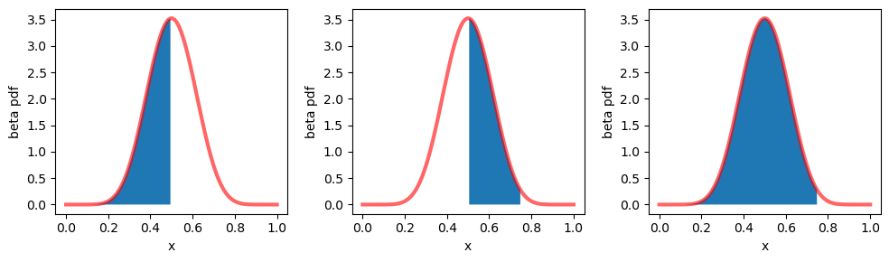
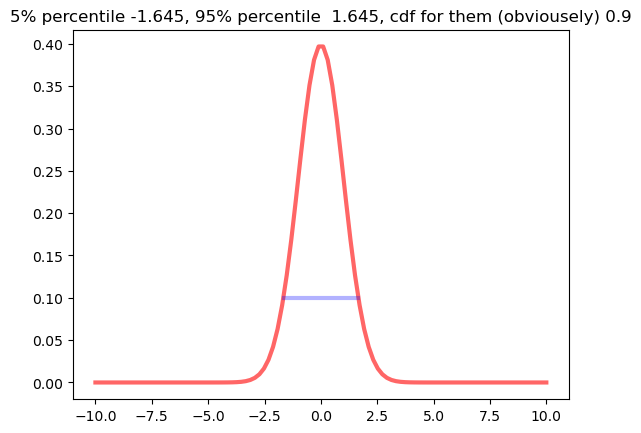

# Cumulative Distribution Function

The cumulative distribution function (CDF) is a fundamental tool for computing interval probabilities — which directly underlies confidence intervals and credible intervals. In cognitive science, we use CDFs whenever we ask questions like "What fraction of participants respond faster than 500 ms?" or "What is the probability that a test score falls below the clinical threshold?"

The CDF exists for every distribution. We define it as
$F(x) = P(X \leq x)$ for random variable $X$. If $X$ is discrete-valued, then the CDF is computed with summation:

$$
F(x) = \sum_{t=-\infty}^{x} f(t)
$$

where $f(t) = P(X = t)$ is the probability mass function (PMF).

If $X$ is continuous, the CDF is computed with an integral:

$$
F(x) = \int_{-\infty}^{x} f(t) \, dt
$$

where $f(t)$ is the probability density function (PDF).

**Example**: Suppose $X \sim \text{Binomial}(5, 0.6)$.
The probability function is given by:

$$
P(X = x \mid n, p) = \binom{n}{x} p^x (1 - p)^{n - x} \quad \text{for } x = 0, 1, \ldots, n
$$

Then

$$
F(1) = P(X \leq 1) = \binom{5}{0}0.6^0(0.4)^{5} + \binom{5}{1}0.6^1(0.4)^{4} = (0.4)^5 + 5(0.6)(0.4)^4 \approx 0.087
$$

**Example**: Suppose $Y \sim \text{Exp}(1)$. The PDF of an exponential distribution is:

$$
f(x \mid \lambda) = \lambda e^{-\lambda x} \quad \text{for } x \geq 0
$$

Then

$$
F(2) = P(Y \leq 2) = \int_0^2 e^{-t} \, dt = -e^{-t}\Big|_0^2 = -(e^{-2} - e^0) = 1 - e^{-2} \approx 0.865
$$

```{admonition} Cognitive Science Example
:class: tip
**Reaction time percentiles.** Suppose reaction times in a Stroop task follow $X \sim N(\mu = 450, \sigma^2 = 80^2)$ ms. What fraction of responses are faster than 350 ms?

$$
F(350) = P(X \leq 350) = \Phi\!\left(\frac{350 - 450}{80}\right) = \Phi(-1.25) \approx 0.106
$$

About 10.6% of responses are faster than 350 ms. Conversely, $P(X > 350) \approx 0.894$.
```

```{important}
The CDF is convenient for calculating probabilities of intervals. Let $a$ and $b$ be any real numbers with $a < b$. Then:

$$
P(a < X \leq b) = P(X \leq b) - P(X \leq a) = F(b) - F(a)
$$
```


## Quantile Function

The CDF takes a value for a random variable and returns a probability. Suppose instead that we start with a number between 0 and 1, call it $p$, and we wish to find the value $x$ so that $P(X \leq x) = p$. The value $x$ which satisfies this equation is called the $p$ **quantile** (or $100p$ **percentile**) of the distribution of $X$.

**Example**: In a standardized test, the 97th percentile of scores among all test-takers is 23. Then 23 is the score you must achieve to score higher than 97% of all test-takers. We could equivalently call $q = 23$ the 0.97 quantile of the distribution of test scores.

**Example**: The middle 50% of probability mass for a continuous random variable is found between the 0.25 and 0.75 quantiles of its distribution. If $Z \sim N(0, 1)$, then the 0.25 quantile is $-0.674$ and the 0.75 quantile is $0.674$. Therefore, $P(-0.674 < Z < 0.674) = 0.5$.

```{admonition} Cognitive Science Example
:class: tip
**Clinical cutoffs from quantiles.** In a standardized cognitive assessment (e.g., WAIS-IV), a score at the 5th percentile ($q_{0.05}$) is often used as a clinical cutoff for impairment. For IQ scores ($X \sim N(100, 15^2)$):

$$
q_{0.05} = 100 + (-1.645)(15) \approx 75.3
$$

Scores below approximately 75 may warrant further neuropsychological evaluation. Similarly, the 2nd percentile ($q_{0.02} \approx 69.2$) is sometimes used as a stricter criterion.
```


## Probability in Python

```{tip}
In Python, the `scipy.stats` library provides a unified interface for working with distributions:

| Function | Description |
|----------|-------------|
| `pdf(x, ...)` | Probability density function |
| `cdf(x, ...)` | Cumulative distribution function |
| `ppf(q, ...)` | Percent point function (inverse of CDF — quantiles) |
| `pmf(x, ...)` | Probability mass function (for discrete distributions) |
```

For example, for a binomial distribution — the probability of getting $x$ successes out of $n$ trials with probability $p$:

```python
from scipy.stats import binom
x, n, p = 3, 5, 0.8
binom.pmf(x, n, p)
```
Result: 0.2048

```python
from scipy.stats import beta
import numpy as np
import matplotlib.pyplot as plt
%matplotlib inline

# CDF EXAMPLE
a, b = 10, 10
x = np.linspace(0, 1, 100)
fig, axs = plt.subplots(1, 3, figsize=(10, 3))
ints = [x < 0.5, (x > 0.5) & (x < 0.75), x < 0.75]
for i in range(3):
    axs[i].plot(x, beta.pdf(x, a, b), 'r-', lw=3, alpha=0.6, label='beta pdf')
    axs[i].set_xlabel('x')
    axs[i].set_ylabel('beta pdf')
    axs[i].fill_between(x, beta.pdf(x, a, b), where=ints[i])
fig.tight_layout()
```




```python
from scipy.stats import norm
x = np.linspace(-10, 10, 100)
plt.plot(x, norm.pdf(x, 0, 1), 'r-', lw=3, alpha=0.6, label='Normal pdf');
p_low = norm.ppf(0.05, 0, 1)
p_upper = norm.ppf(0.95, 0, 1)
p_int = norm.cdf(p_upper, 0, 1) - norm.cdf(p_low, 0, 1)
plt.title(f"5% percentile {p_low:.3f}, 95% percentile {p_upper:.3f}, CDF between them: {p_int:.1f}")
plt.plot([p_low, p_upper], [0.10, 0.10], 'b-', lw=3, alpha=0.3);
```
Result:
5% percentile -1.645, 95% percentile 1.645, CDF between them: 0.9



## Key Takeaways

- The **cumulative distribution function (CDF)** $F(x) = P(X \leq x)$ is defined for every distribution and converts values to probabilities.
- **Interval probabilities** are computed as differences of CDF values: $P(a < X \leq b) = F(b) - F(a)$.
- The **quantile function** (inverse CDF) converts a probability $p$ to the value $x$ such that $P(X \leq x) = p$. Quantiles are essential for constructing confidence and credible intervals.
- In Python, `scipy.stats` provides `cdf()`, `ppf()` (quantile), `pdf()`, and `pmf()` for all standard distributions.

```{seealso}
The CDF and quantile function are used to compute **credible intervals** in {doc}`2.ProbabilityBayesianUpdating` and **confidence intervals** in {doc}`2.FrequentistInference`. For the distributions themselves, see {doc}`3.DistributionsInBayes`.
```
