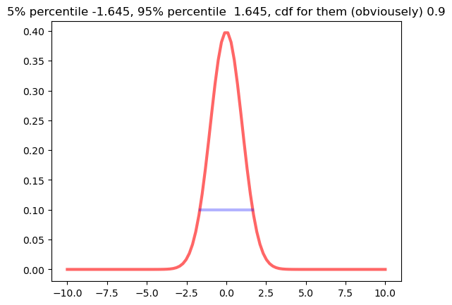

# Cumulative Distribution Function

The cumulative distribution function (CDF) exists for every distribution. We define it as
$F(x) = P(X \leq x)$ for random variable X. If X is discrete-valued, then the CDF is computed with summation:

$$F(x) = \sum_{t=-\inf}^x f(t)$$

where $f(t) = P(X = t)$ is the probability mass function (PMF).

If $X$ is continuous, the CDF is computed with an integral:

$$F(x) = \int_{-\inf}^x f(t)dt$$

where $f(t)$ is the probability density function (PDF).

**Example**: Suppose $X \sim \text{Binomial}(5, 0.6)$. 
The probability function is given by:
$$
P(X = x \mid n, p) = \binom{n}{x} p^x (1 - p)^{n - x} \quad \text{for } x = 0, 1, \ldots, n
$$
Then
$$F(1) = P(X \leq 1) =  \binom{5}{0}0.6^0(1 - 0.6)^{5-0} + \binom{5}{1}0.6^1(1 - 0.6)^{5-1} = (0.4)^5 + 5(0.6)(0.4)^4 ≈ 0.087.$$

**Example**: Suppose $Y \sim Exp(1)$.  The PDF of an exponential distribution is:
$$
f(x \mid \lambda) = \lambda e^{-\lambda x} \quad \text{for } x \geq 0
$$ 
Then
$$F(2) = P(Y ≤ 2) = \int_0^2 e{-t}dt = -e^{-t}|_0^2 = -(e^{-2} - e^0) = 1 - e^{-2} ≈ 0.865.$$

The CDF is convenient for calculating probabilities of intervals. Let $a$ and $b$ be any real numbers with $a < b$. Then the probability that X falls between a and b is equal to $P(a < X \leq b) = P(X \leq b) - P(X \leq a) = F(b) - F(a)$.


## Quantile Function
The CDF takes a value for a random variable and returns a probability. Suppose instead that we start with a number between 0 and 1, call it p, and we wish to find the value x so that $P(X \leq x) = p$. The value $x$ which satisfies this equation is called the $p$ quantile (or $100p$ percentile) of the distribution of X.

**Example**: In a standardized test, the 97th percentile of scores among all test-takers is 23. Then 23 is the score you must achieve on the test to score higher than 97% of all test-takers. We could equivalently call q = 23 the .97 quantile of the distribution of test scores.

**Example**: The middle 50% of probability mass for a continuous random variable is found between the .25 and .75 quantiles of its distribution. If Z ~ N(0, 1), then the .25 quantile is -0.674 and the .75 quantile is 0.674. Therefore, P(-0.674 < Z < 0.674) = 0.5.

## Probability in python
In python the best library with all distributions is scipy.stats

 - pdf(x, **kwargs) Probability density function.
 - cdf(x, **kwargs) Cumulative distribution function.
 - ppf(q, **kwargs) Percent point function (inverse of cdf — percentiles).
 - pmf (x, **kwargs) Probability mass function (for discrete distributions)

For example for binomial distribution, probability get x, out of n with probability p:
```python
from scipy.stats import binom
x, n, p = 3,5,0.8
binom.pmf(x,n, p)
```
result: 0.20479999999999995

```python
from scipy.stats import beta
import numpy as np
import matplotlib.pyplot as plt
%matplotlib inline


# CDF EXAMPLE
a, b = 10, 10
bounds = 0, 95
x = np.linspace(0, 1, 100)
fig, axs=plt.subplots(1,3, figsize = (10,3))
ints = [x<0.5, (x > 0.5)&(x < 0.75), x<0.75]
for i in range(3):
    axs[i].plot(x, beta.pdf(x, a, b), 'r-', lw=3, alpha=0.6, label='beta pdf')
    axs[i].set_xlabel('x')
    axs[i].set_ylabel('beta pdf')
    axs[i].fill_between(x, beta.pdf(x, a, b), where = ints[i])
fig.tight_layout()
```


```python
from scipy.stats import norm
x = np.linspace(-10, 10, 100)
plt.plot(x, norm.pdf(x, 0, 1), 'r-', lw=3, alpha=0.6, label='Normal pdf');
p_low = norm.ppf(0.05, 0, 1)
p_upper = norm.ppf(0.95, 0, 1)
p_int  = norm.cdf(p_up, 0, 1) - norm.cdf(p_low, 0, 1) 
plt.title(f"5% percentile {p_low :.3f}, 95% percentile {p_upper: .3f}, cdf for them (obviousely) {p_int}")
plt.plot([p_low, p_upper], [0.10,0.10], 'b-', lw=3, alpha=0.3);
```
Result: 
5% percentile -1.645, 95% percentile  1.645, cdf for them (obviousely) 0.9


