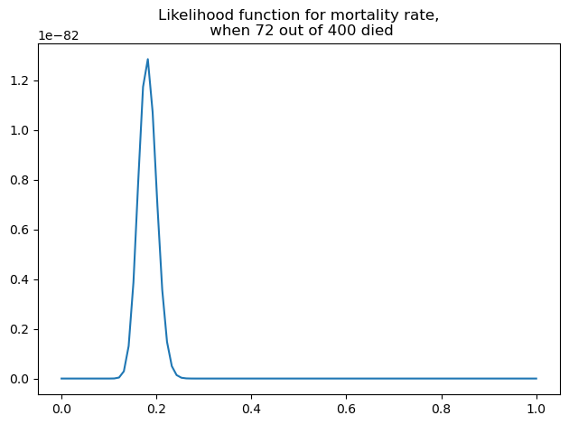

# Frequentist Approach to Inference

## Frequentist Paradigm

In the **frequentist paradigm**, data is viewed as a random sample from a larger, often hypothetical, population. Probability statements are made in terms of **long-run frequencies** over repeated sampling from this population.

### Example: Coin Flips

Suppose we flip a coin 100 times and observe 44 heads and 56 tails. These 100 flips can be seen as a random sample from an infinite sequence of flips of the same coin. Each flip $x_i$ follows a Bernoulli distribution with success probability $p$. Although $p$ is unknown, it is assumed to be a **fixed parameter**, because the physical properties of the coin do not change.

### Estimating the Probability of Heads

We want to estimate $p$ and quantify our uncertainty. By the **Central Limit Theorem (CLT)**, the sum of the flips is approximately normal:

$$
\sum x_i \sim \mathcal{N}(100p, 100p(1-p)).
$$

With 95% probability, the sum falls within 1.96 standard deviations of the mean:

$$
100p - 1.96 \sqrt{100p(1-p)} \leq \sum x_i \leq 100p + 1.96 \sqrt{100p(1-p)}.
$$

From the observed 44 heads, the estimate is:

$$
\hat{p} = \frac{44}{100} = 0.44.
$$

### Confidence Interval Calculation

Plugging $\hat{p}$ into the bounds gives:

$$
44 \pm 1.96 \sqrt{44 \times 0.56} \approx 44 \pm 9.7,
$$

which corresponds to 34.3 to 53.7 heads. Converting to probabilities:

$$
0.343 \leq p \leq 0.537.
$$

Thus, the **95% confidence interval** suggests the true probability of heads lies between 0.343 and 0.537.

### Interpretation of the Confidence Interval

If we want to test fairness ($p = 0.5$), note that $0.5$ is inside the CI, so fairness is consistent with the data.  

However, the **95% confidence** statement is subtle: in repeated experiments, 95% of calculated CIs would contain the true $p$. For the single interval we computed, $p$ is either inside (probability 1) or outside (probability 0).

---

## Contrast with Bayesian Approach

In the **Bayesian approach**, we directly compute the **posterior distribution** for $p$ and can say:  

> "There is a 95% probability that $p$ lies in the interval, given the observed data."

### Frequentist vs. Bayesian Intervals

- **Frequentist Confidence Interval**: Probability refers to long-run frequency of coverage over repeated samples.  
- **Bayesian Credible Interval**: Directly interpretable as the probability that $p$ is within the interval given data and prior.  

### Choosing Between Approaches

- **Frequentist CI**: Useful for long-run performance guarantees.  
- **Bayesian CI**: More intuitive for direct probability statements, but requires specifying a prior.

---

## Example: Estimating Mortality Rate Using the Frequentist Approach

Suppose 400 patients are admitted to a hospital for heart attacks. After a month, 72 have died and 328 survived. We want to estimate the **mortality rate**.

### Reference Population

Possible choices for the population include:
1. All heart attack patients in the region.  
2. Heart attack patients admitted to this hospital over a longer period.  

Neither perfectly matches our data, but frequentist inference always assumes a conceptual **reference population**.

### Bernoulli Model

Each patient outcome (death/survival) is modeled as Bernoulli($\theta$):

$$
P(Y_i = 1) = \theta,
$$

where $\theta$ is the mortality rate.

### Likelihood Function

For $n$ patients with $S$ deaths:

$$
L(\theta \mid \mathbf{y}) = \theta^{S} (1 - \theta)^{n-S}.
$$

This is the **likelihood function**.

### Maximum Likelihood Estimate (MLE)

Taking logs:

$$
\log L(\theta) = S \log \theta + (n-S) \log(1-\theta).
$$

Maximizing this gives:

$$
\hat{\theta} = \frac{S}{n}.
$$

### Applying to Data

Here $S=72$, $n=400$:

$$
\hat{\theta} = \frac{72}{400} = 0.18.
$$

Thus, the estimated mortality rate is **18%**.

### Python Example

```python
import numpy as np
import matplotlib.pyplot as plt

def likelihood(n, y, theta):
    return theta**y * (1-theta)**(n-y)

theta = np.linspace(0, 1, 200)
plt.plot(theta, likelihood(400, 72, theta))
plt.title('Likelihood function for mortality rate\n(72 deaths out of 400)')
plt.xlabel(r'$\theta$')
plt.ylabel('Likelihood')
plt.tight_layout()
plt.show()
```



