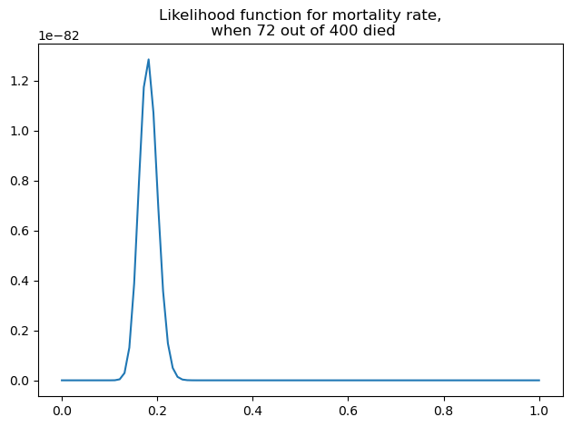

# Frequentist Approach to Inference

The frequentist paradigm is the dominant framework in psychology and cognitive science — it underlies the t-tests, ANOVAs, and p-values that you encounter in most published research. Understanding its logic and limitations is essential, both for reading the literature and for appreciating what the Bayesian alternative offers.

## Frequentist Paradigm

In the frequentist paradigm, data is viewed as a random sample from a larger, potentially hypothetical population. Probability statements are made in terms of long-run frequencies based on this larger population.

### Example: Coin Flips

Suppose we flip a coin 100 times and observe 44 heads and 56 tails. We can consider these 100 flips as a random sample from a much larger, infinite hypothetical population of flips from this coin. In this case, each flip $x_i$ follows a Bernoulli distribution with some probability $p$. Although $p$ may be unknown, it is assumed to be fixed because we have a particular physical coin.

### Estimating the Probability of Heads

We can estimate the probability of getting a head ($p$) and assess our confidence in that estimate.

Using the Central Limit Theorem (CLT), we can approximate the sum of the 100 flips ($\sum x_i$) as normally distributed:

$$
\sum x_i \sim \mathcal{N}(100p, 100p(1-p))
$$

According to the CLT, 95% of the time, our observations will fall within 1.96 standard deviations of the mean. This can be expressed as:

$$
100p - 1.96 \sqrt{100p(1-p)} \leq \sum x_i \leq 100p + 1.96 \sqrt{100p(1-p)}
$$

Given our observation of 44 heads, we estimate $\hat{p}$ as:

$$
\hat{p} = \frac{44}{100} = 0.44
$$

### Confidence Interval Calculation

Plugging this estimate into the theoretical bounds, we calculate the Confidence Interval (CI) for $p$:

$$
44 \pm 1.96 \sqrt{44 \times 0.56} = 44 \pm 9.7
$$

Thus, the CI ranges from approximately 34.3 to 53.7. Converting this to a probability statement:

$$
0.343 \leq p \leq 0.537
$$

We are 95% confident that the true probability of getting a head lies within this interval.

### Interpretation of the Confidence Interval

If we want to assess whether the coin is fair (i.e., $p = 0.5$), we see that 0.5 falls within our interval, suggesting that it is reasonable to assume fairness.

```{warning}
**What "95% confidence" really means.** A 95% confidence interval does NOT mean there is a 95% probability that $p$ lies within this particular interval. It means that if we were to repeat this experiment many times and calculate a CI each time, about 95% of those intervals would contain the true value of $p$. For any given interval, the probability that $p$ lies within it is technically 0 or 1 — it either does or does not. This subtle distinction is one of the most common sources of misinterpretation in statistics.
```

```{admonition} Cognitive Science Example
:class: tip
**Confidence interval for response accuracy.** In a psychophysics experiment, a participant completes 200 trials of a visual discrimination task and responds correctly on 156 trials. We estimate the accuracy rate and compute a 95% CI:

- $\hat{p} = 156/200 = 0.78$
- $SE = \sqrt{\hat{p}(1 - \hat{p})/n} = \sqrt{0.78 \times 0.22 / 200} \approx 0.029$
- 95% CI: $0.78 \pm 1.96 \times 0.029 = [0.723,\; 0.837]$

Since 0.50 (chance level) is far below the lower bound of the CI, we conclude that the participant's performance is reliably above chance.
```


## Contrast with Bayesian Approach

In the Bayesian approach, we can directly compute an interval and say that there is a 95% probability that $p$ lies within that interval, based on the posterior distribution.

### Frequentist vs. Bayesian Intervals

- **Frequentist Confidence Interval**: Interpreted as the long-run frequency of intervals that contain the true parameter value if the experiment were repeated many times.
- **Bayesian Credible Interval**: Directly interpreted as the probability that the parameter lies within the interval given the observed data.

### Choosing Between Approaches

- **Frequentist CI**: Preferred when you want to make statements about the long-run frequency of an event occurring based on repeated sampling.
- **Bayesian Credible Interval**: Preferred when you want to make probability statements about the parameter given the observed data, incorporating prior knowledge.

Choosing between these approaches often depends on the context and the type of inference desired. The Bayesian approach provides a more intuitive interpretation in many cases but requires a prior, which might not always be available or easily defined.


## Example: Estimating Error Rate in a Visual Working Memory Task

We'll now apply the frequentist approach to estimating the error rate in a cognitive experiment. A researcher studies visual working memory using a change detection task: on each trial, a participant briefly views an array of colored squares, then reports whether one square changed color. The researcher collects $n = 400$ trials from a single participant. The participant makes errors (incorrect responses) on 72 trials and responds correctly on 328 trials. We aim to estimate the error rate using the frequentist approach.

### Establishing the Reference Population

Under the frequentist paradigm, we need to establish a reference population. Possible choices include:

1. **All trials this participant could perform under identical conditions** (a hypothetical infinite sequence of trials).
2. **Trials from similar participants performing the same task** (generalizing across people).

While both options are reasonable, neither is fully observed. The frequentist approach treats the 400 trials as a random sample from one of these hypothetical populations and estimates the error rate from the observed proportion.

## Estimation Approach

### Bernoulli Distribution

We can model each trial's outcome (correct or error) using a Bernoulli distribution with an unknown parameter $\theta$. Here, $\theta$ represents the probability of making an error on any given trial. For each trial $i$:

$$
P(Y_i = 1) = \theta
$$

### Joint Probability Mass Function

The joint probability mass function for the entire set of data (denoted as a vector $\mathbf{Y}$) given $\theta$ is:

$$
P(\mathbf{Y} = \mathbf{y} \mid \theta) = \prod_{i=1}^{n} P(Y_i = y_i \mid \theta) = \prod_{i=1}^{n} \theta^{y_i} (1 - \theta)^{1 - y_i}
$$

This product form arises because each observation is independent.

### Likelihood Function

Now, consider this expression as a function of $\theta$. This is known as the **likelihood function**:

$$
L(\theta \mid \mathbf{y}) = \prod_{i=1}^{n} \theta^{y_i} (1 - \theta)^{1 - y_i}
$$

Although it resembles the probability density, it is now viewed as a function of $\theta$ given the data $\mathbf{y}$.

### Maximum Likelihood Estimate (MLE)

To estimate $\theta$, we choose the value that maximizes the likelihood function, known as the **Maximum Likelihood Estimate (MLE)**. In practice, it's easier to maximize the **log-likelihood**:

$$
\log L(\theta) = \sum_{i=1}^{n} \left( y_i \log \theta + (1 - y_i) \log (1 - \theta) \right)
$$

The logarithm simplifies the product into a sum, making it easier to handle mathematically.

### Simplifying the Log-Likelihood

For independent and identically distributed (i.i.d) data:

$$
\log L(\theta) = \left( \sum_{i=1}^{n} y_i \right) \log \theta + \left( \sum_{i=1}^{n} (1 - y_i) \right) \log (1 - \theta)
$$

Substituting the sums:

$$
\log L(\theta) = S \log \theta + (n - S) \log (1 - \theta)
$$

where $S = \sum_{i=1}^{n} y_i$ is the total number of "successes" (errors in this context).

### Maximizing the Log-Likelihood

To find the MLE of $\theta$, we take the derivative of the log-likelihood with respect to $\theta$ and set it to zero:

$$
\frac{d}{d\theta} \log L(\theta) = \frac{S}{\theta} - \frac{n - S}{1 - \theta} = 0
$$

Simplifying:

$$
\frac{S}{\theta} = \frac{n - S}{1 - \theta}
$$

```{important}
**MLE for Bernoulli/Binomial data.** Solving for $\theta$:

$$
\hat{\theta} = \frac{S}{n}
$$

The MLE is simply the sample proportion — the number of "successes" divided by the total number of observations.
```

### Applying the Formula

In our example:

- $n = 400$ (total trials)
- $S = 72$ (error trials)

Thus:

$$
\hat{\theta} = \frac{72}{400} = 0.18
$$

The MLE for the error rate is 0.18, or 18%. The participant responds correctly on about 82% of trials in this change detection task.

```{admonition} Cognitive Science Example
:class: tip
**MLE for recall probability.** A researcher tests memory recall: each of 80 participants either recalls a target word or does not ($Y_i \sim \text{Bernoulli}(\theta)$). Of 80 participants, 52 recall the word. The MLE is:

$$
\hat{\theta} = \frac{52}{80} = 0.65
$$

The likelihood function peaks at 0.65, indicating this is the value of $\theta$ that makes the observed data most probable — under the assumption that each participant's recall is an independent Bernoulli trial with the same probability $\theta$.
```

In Python code for the likelihood function:

```python
def likelihood(n, y, theta):
    lik = theta**y * (1 - theta)**(n - y)
    return lik
theta = np.linspace(0, 1, 100)
plt.plot(theta, likelihood(400, 72, theta));
plt.title('Likelihood function for error rate,\n when 72 errors in 400 trials');
plt.tight_layout()
```



## Conclusion

The MLE provides a straightforward method for estimating parameters under the frequentist approach, by maximizing the likelihood function based on the observed data. While setting up reference populations and interpreting results can be challenging — especially with hypothetical infinite populations — the frequentist method remains a foundational approach in statistical inference.

## Key Takeaways

- The **frequentist paradigm** treats parameters as fixed unknown constants and makes probability statements about data (long-run frequencies), not about parameters.
- The **likelihood function** $L(\theta \mid y)$ has the same form as the data probability but is viewed as a function of $\theta$ for fixed data.
- The **maximum likelihood estimate (MLE)** is the parameter value that maximizes the likelihood. For Bernoulli data, the MLE is simply the sample proportion $\hat{\theta} = S/n$.
- A **95% confidence interval** means that if we repeated the experiment many times, about 95% of the resulting intervals would contain the true parameter — it does **not** mean there is a 95% probability that the parameter is in this particular interval.
- The frequentist approach requires specifying a **reference population**, which can be philosophically challenging when the population is hypothetical.

```{seealso}
For the Bayesian alternative — where we combine the likelihood with a prior distribution to obtain a full posterior — see {doc}`2.ProbabilityBayesianUpdating`. The Bernoulli and Binomial distributions used here are reviewed in {doc}`3.DistributionsInBayes`.
```
