# Bayesian Modelling Steps

## What are the objectives of statistical models?
Statistical models are essential tools in the broader field of data science, helping us plan, collect, and analyze data to draw scientifically defensible conclusions. They are used across a wide variety of disciplines, including:

- Business
- Medicine
- Biology
- Sports
- Social sciences
- Pharmacology
- Agriculture
- Ecology
.

## What is a Statistical Model?
We define a **statistical model** as a mathematical structure used to **imitate** and **approximate** the data-generating process. It describes relationships among variables while accounting for uncertainty and variability in the data. For instance, in an experiment aiming to reveal a cause-and-effect relationship, a statistical model helps account for uncertainty in the data using **probability theory**.

### Example: Cause and Effect Relationships
If the relationships between variables are complicated or involve unmeasurable factors, the data may appear random. A statistical model, by incorporating probability, helps identify **structural relationships** hidden in noisy data.

### Example: Polling Uncertainty
Consider a poll where 57% of participants favor a candidate. Naturally, we ask:
- How confident are we in this 57%?
- Does it represent the entire population?

The answer depends on several factors:
- How were participants selected?
- How many people were polled?

Repeating the poll with a different sample may yield a different result. Using probability theory, we can estimate and account for the uncertainty surrounding such an estimate.

## Four Common Objectives of Statistical Models

### 1. Quantify Uncertainty
One key objective is to **quantify uncertainty** in the data. In the polling example, rather than solely reporting 57%, a statistician might estimate that, with 99% confidence, the true percentage is between 51% and 63%. This range helps provide context and indicates how much we can trust the estimate.

###2. Inference
Another objective is **inference**, where a statistical model allows us to extend results from a sample to the entire population. In the polling example, we might infer the percentage of the total population that supports a candidate. Additionally, a model may help us understand how other demographic variables relate to the likelihood of supporting the candidate.

### 3. Hypothesis Testing
Statistical models also help in **measuring evidence** for or against a hypothesis. In our polling example, if an expert claims that a candidate is more popular with men than women, we could use further data (e.g., 55% of women vs. 59% of men favoring the candidate) to evaluate the strength of this hypothesis.

### 4. Prediction
Lastly, statistical models are used for **prediction**. Given demographic information about a voter, but not their candidate preference, a model can predict which candidate they might support. This is a practical application of statistical models in forecasting and decision-making.

## Statistical Models and Machine Learning

Both **statistical modeling** and **machine learning** play significant roles in data science:

- Machine learning uses algorithms (some based on statistical models) to produce state-of-the-art predictions.
- Machine learning excels at **objective 4 (prediction)** but often involves building complicated models that are difficult to interpret. These are sometimes called "black boxes."

While machine learning emphasizes prediction accuracy, statistical models aim to balance all four objectives — **uncertainty quantification, inference, hypothesis testing, and prediction** — to answer diverse questions about the data.

## Conclusion

Statistical modeling contributes significantly to data science by:
- Quantifying uncertainty
- Supporting inference
- Testing hypotheses
- Making predictions

Machine learning, which often specializes in prediction, complements statistical modeling, helping to solve complex data-driven problems. Understanding the goals and methods of statistical models is crucial for answering key questions and drawing reliable conclusions from data.

## The Statistical Modelling Process

Building statistical models is a step-by-step process, and each step should be taken carefully. Here, we outline the general process and offer some practical advice. We will refer to this as the **statistical modeling process**.

## Step 1: Understand the Problem
Understanding the problem and context is critical to success. A sophisticated model might be useless if applied inappropriately. For example, if you have revenue data from several store locations but don't know their geographical context, averaging those revenues may not make sense—especially if the stores are in different countries and reporting in different currencies. Always make sure your data context matches your problem.

## Step 2: Plan and Collect Relevant Data
Proper planning ensures that the right data is collected. You'll need to decide:
- What information is most relevant to solving the problem.
- How to collect that data.
- How many data points are necessary.

The quality of your data collection determines the value of your analysis. For instance, surveying only your workplace peers won’t generalize well to all employees across multiple work sites. A better approach would involve selecting a random sample from all employees.

## Step 3: Explore the Data
Before modeling, explore your data to:
- Ensure the data collection plan was followed.
- Verify that data was recorded accurately.
- Investigate any major surprises or anomalies in the data.

During this step, it’s important to visualize the data to understand basic relationships between variables. However, **data snooping** (mining for hypotheses) can lead to invalid models. To avoid this, randomly split your data into two parts:
- Use one part to explore and fit different models.
- Use the other part to validate the model to ensure generalizability.

## Step 4: Postulate a Model
After understanding your data, choose a model that can summarize the relationships within it. This might be:
- A standard statistical model like regression.
- A model based on scientific theory, such as a growth model.

You may have to balance **model complexity** and **generalizability** (the bias-variance tradeoff). Complex models may fit your data well but fail to generalize to new datasets. 

For example, a simple linear regression model may capture the general trend in your data, while an overly complex model (like an interpolator) may fit the current dataset perfectly but struggle with new data.

## Step 5: Fit the Model
This step involves estimating the parameters of your model using the data. In this course, we take a **Bayesian approach** to parameter estimation.

## Step 6: Check the Model
Once fitted, you need to check if the model adequately represents the data:
- Are the predictions realistic?
- Does the model fit well, or does it miss some important features?

Techniques such as **residual analysis** and **predictive checks** can be used here. You may also compare competing models based on specific criteria to choose the best one.

## Step 7: Iterate
If your model is inadequate, return to **Step 4** and repeat the process with a new model that addresses previous shortcomings. Iteration is a key aspect of the modeling process.

## Step 8: Use the Model
Once you have refined your model through iteration, you can use it to answer the original research questions and draw conclusions.

## Bayesian modelling example

## Defining a Statistical Model

A **statistical model** is a mathematical structure used to imitate or approximate the data-generating process. It incorporates uncertainty and variability using probability theory.

### Simple Example: Modeling Heights of 15 Men

Consider an example where we have the heights of 15 adult men. While collecting genetic data to fully explain variability would be expensive or impossible, we can still model the heights using a **normal distribution**.

For each individual $i$:

$$
y_i = \mu + \epsilon_i
$$

- $y_i$: Height of individual $i$
- $\mu$: Mean height across all men
- $\epsilon_i$: Error term for individual $i$, which is assumed to come from a normal distribution with mean 0 and variance $\sigma^2$.

This model assumes that the error terms $\epsilon_i$ are **independent and identically distributed (i.i.d.)** from the normal distribution:

$$
\epsilon_i \sim N(0, \sigma^2)
$$

We can write this equivalently for the heights $y_i$ directly:

$$
y_i \sim N(\mu, \sigma^2)
$$

This statistical model captures the variability in the data using the parameters $\mu$ and $\sigma^2$.

### Frequentist vs Bayesian Approaches

- **Frequentist Approach**: Treats $\mu$ and $\sigma^2$ as fixed but unknown constants. We estimate them based on the data and consider how estimates might change if we repeated the experiment multiple times.
- **Bayesian Approach**: Treats $\mu$ and $\sigma^2$ as random variables with their own probability distributions (priors). The Bayesian approach uses probability directly to express uncertainty in these parameters.

### Key Components of Bayesian Models

Bayesian models are built using three primary components:
1. **Likelihood**: The probabilistic model for the data. It describes how the data is generated given the unknown parameters. Written as $P(y \mid \theta)$, where $\theta$ represents the unknown parameters.
   
2. **Prior**: The probability distribution that expresses our uncertainty about $\theta$ before seeing the data. Denoted $P(\theta)$.

3. **Posterior**: The probability distribution of $\theta$ after observing the data, $P(\theta \mid y)$. The posterior is derived using **Bayes' Theorem**:

$$
P(\theta \mid y) = \frac{P(y \mid \theta) P(\theta)}{P(y)}
$$

Where:
- $P(y)$: The **marginal likelihood** or **evidence** obtained by integrating over all possible values of $\theta$.

### Bayes' Theorem Breakdown

Using **conditional probability** and **Bayes' Theorem**, we calculate the posterior distribution:

1. **Joint Distribution**: The product of the prior and the likelihood:
   
$$
   P(\theta, y) = P(\theta) P(y \mid \theta)
$$

2. **Posterior**: The conditional distribution of $\theta$ given $y$:
   
$$
   P(\theta \mid y) = \frac{P(y \mid \theta) P(\theta)}{\int P(y \mid \theta) P(\theta) d\theta}
$$

   If $\theta$ is discrete, the integral becomes a sum.

### Conclusion: The Posterior as a Primary Tool

The **posterior distribution** is the main tool for making inferences in Bayesian models. It allows us to account for uncertainty in the parameters and make informed decisions based on the data.

In the next lessons, we will explore how to use the posterior distribution to achieve various statistical modeling objectives.

## Specifying a Bayesian Model

Before fitting a model, we must specify all of its components. One convenient way to do this is by writing the model in **hierarchical form**. This involves specifying the model in layers, starting from the **likelihood** and moving through the **prior** distributions.

### Hierarchical Model Example: Heights of Men

In the previous lesson, we modeled the heights of 15 men:
$$
y_i \mid \mu, \sigma^2 \sim N(\mu, \sigma^2)
$$
This means that the height $y_i$ for each individual $i$ comes from a normal distribution with mean $\mu$ and variance $\sigma^2$ , and the observations are independent and identically distributed (i.i.d.).

#### Prior Distributions

Next, we specify prior distributions for $\mu$ and $\sigma^2$, assuming they are independent:

- **Prior for $\mu$**: A normal distribution with mean $\mu_0$ and variance $\sigma_0^2$:
  $$
  \mu \sim N(\mu_0, \sigma_0^2)
  $$
- **Prior for $\sigma^2$**: An **inverse gamma distribution** with shape parameter $\nu_0$ and scale parameter $\beta_0$:
  $$
  \sigma^2 \sim \text{Inverse Gamma}(\nu_0, \beta_0)
  $$

These choices are **conjugate priors**, meaning they lead to a posterior distribution that is of the same family as the prior.

### Graphical Representation

Another way to specify a Bayesian model is through a **graphical model**. In a graphical representation, we illustrate the relationships between the model's components using nodes and arrows.

- **Nodes**: Represent random variables, drawn as circles. A shaded or double-circled node indicates an **observed** variable (i.e., data).
- **Arrows**: Indicate dependence between variables. For example, arrows from $ \mu $ and $\sigma^2$ to $y_i$ show that the distribution of $y_i$ depends on these parameters.

#### Graphical Model Example

In this model, we have the following structure:

1. **Nodes for Parameters**:
   - $\mu$ and $\sigma^2$, which are random variables.
2. **Nodes for Data**:
   - $y_1, y_2, \dots, y_n$, where each $y_i$ is observed.
3. **Arrows**:
   - Arrows from $\mu$ and $\sigma^2$ to each $y_i$, indicating that the heights $y_i$ depend on these parameters.

```mermaid
graph TD
    mu(("𝜇~ N(m0, s0)" ))
    sigma2(("𝜎²~InvGamma(nu0, b0)"))
    y1["y₁ (observation)"]
    y2["y₂ (observation)"]
    yn["yₙ (observation)"]

    %% Parameter dependencies
    mu --> y1
    mu --> y2
    mu --> yn
    sigma2 --> y1
    sigma2 --> y2
    sigma2 --> yn

```

#### Simplifying with Plates

When all the $y_i$ are **exchangeable** (i.e., their distribution doesn't change if we permute the indices), we can simplify the graphical model using a **plate**. A plate groups multiple nodes together to avoid redundancy.

- A plate indicates that there are $n$ instances of $y_i$, and they all depend on the same $\mu$ and $\sigma^2$.
- This implies exchangeability, meaning that the model treats each observation symmetrically.

### Hierarchical and Graphical Models

Both the hierarchical and graphical representations can be used to describe how to simulate data from the model. In practice, this involves starting with variables that have no dependencies (e.g., $\mu$ and $\sigma^2$) and then generating the data $y_i$ given the parameters.

This process also applies to **simulating from a prior predictive distribution**, where you simulate both the parameters and the data from their prior distributions.

### Expanding Hierarchical Models and Non-Conjugate Priors

In this section, we discuss extending hierarchical models by adding more layers and dealing with models that do not have conjugate priors.

#### More Complex Hierarchical Models

Previously, we fixed the values of hyperparameters (e.g., $\mu_0$, $sigma_0$, $\nu_0$, and $\beta_0$) in the model. However, in hierarchical models, we can introduce **priors for hyperparameters**, making the model more flexible. This approach is especially useful when data are hierarchically structured, meaning that the observations are naturally grouped.

For example, consider the model:

$$
y_i \mid \mu, \sigma^2 \sim N(\mu, \sigma^2), \quad i = 1, \dots, n
$$

Instead of using independent priors for $\mu$ and $\sigma^2$, we allow the prior for $\mu$ to depend on $\sigma^2$:

$$
\mu \mid \sigma^2 \sim N(\mu_0, \sigma^2 / \omega_0)
$$

In this case, $\sigma^2$ controls the variability of $\mu$, scaling its variance by a factor of $1 / \omega_0$. This model has three levels, with $\mu$ dependent on $\sigma^2$, and the $y_i$'s dependent on both. The final piece is the prior for $\sigma^2$, which we assume follows an **inverse gamma distribution**.

#### Graphical Representation

We can extend the graphical representation to accommodate this new hierarchical structure:
1. **Top level**: $\sigma^2$, as it has no dependencies.
2. **Middle level**: $\mu$, which depends on $\sigma^2$.
3. **Bottom level**: $y_i$'s, which depend on both $\mu$ and $\sigma^2$.

Since $y_1, y_2, \dots, y_n$ are observed and exchangeable, they are grouped on a plate to indicate that there are multiple exchangeable variables.

```mermaid
graph TD 
	%% Top level 
	sigma2(("𝜎² (variance)")) 
	%% Middle level 
	sigma2 -->  mu(("𝜇 (mean)")) 
	%% Bottom level - Plate notation (grouped observations) 
	y[["y₁ (obs),y₂ (obs), ... yn (obs)"]]


	%% Connections indicating dependencies 

	mu --> y
	

```

#### Joint Distribution and Posterior

To fit the model, we need the **full posterior distribution**. By **Bayes' theorem**, the posterior is proportional to the joint distribution of all random variables and parameters:

$$
p(\mu, \sigma^2 \mid y_1, \dots, y_n) \propto p(y_1, \dots, y_n \mid \mu, \sigma^2) \cdot p(\mu \mid \sigma^2) \cdot p(\sigma^2)
$$

This involves:
- **Likelihood**: The product of normal distributions for each $y_i$.
- **Prior for $\mu$**: A normal distribution with parameters $\mu_0$ and $\sigma^2 / \omega_0$.
- **Prior for $\sigma^2$**: An inverse gamma distribution.

The posterior distribution is proportional to the **joint distribution** of all variables. If the priors are conjugate, the posterior takes a known form, but when priors are non-conjugate or the model is complex, the posterior may not have a standard distribution.

### Non-Conjugate Priors

Now, let’s consider a model where the prior is **non-conjugate**, making the posterior more challenging to work with.

#### Example: One-Parameter Model with Non-Conjugate Prior

Suppose we observe the **percentage change in personnel** for 10 companies in an industry, which we assume are independent draws from a normal distribution with known variance $\sigma^2 = 1$ and unknown mean $\mu$:

$$
y_i \mid \mu \sim N(\mu, 1)
$$

Instead of using a conjugate normal prior for $\mu$, we opt for a **t-distribution** prior with heavy tails:

$$
\mu \sim t(0, 1, 1)
$$

This prior can accommodate extreme values for $\mu$ better than a normal prior. The posterior is proportional to the product of the likelihood and this prior:

$$
p(\mu \mid y_1, \dots, y_n) \propto \prod_{i=1}^{n} N(y_i \mid \mu, 1) \cdot t(\mu \mid 0, 1, 1)
$$

While we can simplify this expression, the posterior does not resemble a known distribution, making it difficult to simulate or integrate directly.

#### Example: Two-Parameter Model with Non-Conjugate Prior

When both $\mu$ and $\sigma^2$ are unknown in a normal likelihood model, and we use non-conjugate priors, the posterior distribution is even more complex. Even though conjugate priors provide closed-form solutions, non-conjugate priors may result in posteriors that don’t have standard forms.

### Challenges of Non-Conjugate Posteriors

Historically, the complexity of non-conjugate posteriors limited the use of Bayesian methods to simpler models. However, with the development of **computational methods** in the 1950s, statisticians gained the ability to simulate from complicated posterior distributions, which revolutionized Bayesian analysis.

In the next lesson, we will delve into how to simulate from these posteriors and fit more complex Bayesian models using advanced techniques.

### Conclusion

We have explored:
- The extension of hierarchical models by adding more layers.
- The graphical representation of these models.
- The challenge of non-conjugate priors, where the posterior distribution doesn't have a standard form, requiring computational methods to simulate or integrate.

In upcoming lessons, we’ll explore techniques to handle these complex models using simulations.

