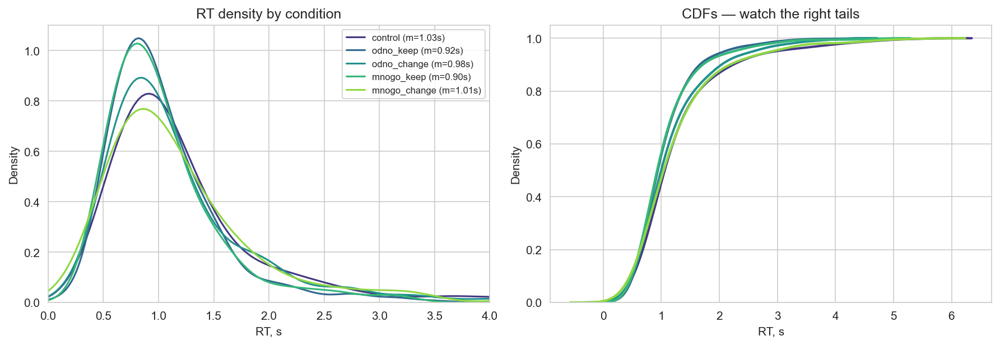
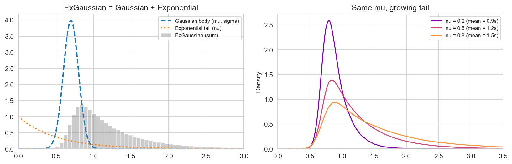
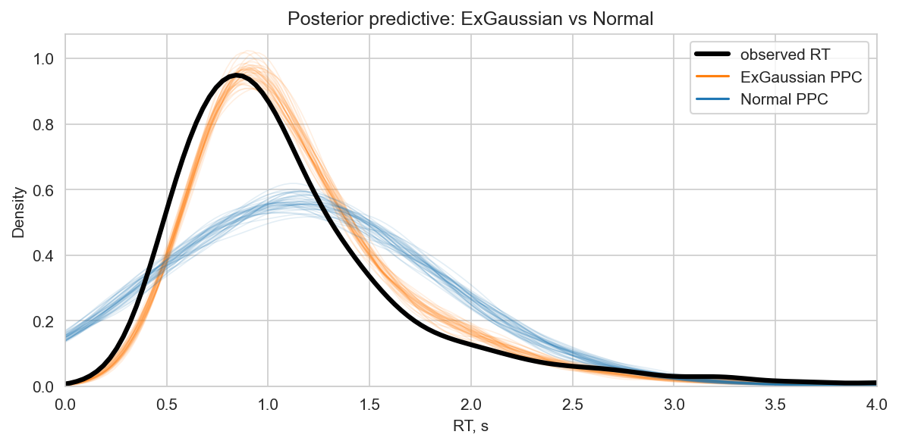

# Case Study: Semantic Ambiguity and Response Times — ExGaussian Modeling and a Convergence Rescue

[](https://colab.research.google.com/github/iknyazeva/bayes-cogsci-book/blob/main/case_studies/CaseStudies.AmbiguityRT.ipynb)

*A hierarchical RT model where the likelihood is a psychological theory — including the true story
of how its first version refused to converge, and the three fixes that saved it.*

```{admonition} What this chapter is
:class: tip
A **worked case study** from the Gershkovich lab's semantic-ambiguity project (2026 experiment:
73 participants, 72 stimuli, 2,294 RTs), implemented in PyMC 5. The full executable code lives in
the companion interactive notebook; all figures are generated by it.
Unlike the other case studies, this one is not about re-translating old code — it is about two
things every analyst eventually meets: **skewed RT data** and **a sampler that fails**.
```

**Prerequisites.** Continuous outcomes & robust models (Session 7), MCMC & convergence diagnostics
(Sessions 6 & 11), hierarchical models (Session 10).

---

## 1. The research question

Words like *коса* (braid / scythe / sandbar) carry several meanings. When such a word is processed
in one meaning, its alternatives are activated and then **suppressed**. On the
negative-priming account, that suppression is measurable: responding to the *suppressed*
alternative shortly afterwards should be **slower**.

The two-stage paradigm:

* **Stage 1 (prime):** answer a question about a word — for ambiguous words the question targets
  one meaning; for unambiguous words there is only one to target.
* **Stage 2 (probe, analyzed here):** lexical decision. The probe word is the **same** meaning
  (keep), the **other** meaning (change), or an unprimed **control** word.

| condition | stage 1 | stage 2 probe |
|---|---|---|
| control | — | new word |
| `odno_keep` | unambiguous | same word |
| `odno_change` | unambiguous | different word |
| `mnogo_keep` | ambiguous | same meaning |
| `mnogo_change` | ambiguous | **other meaning** ← the negative-priming cell |

The negative-priming prediction: `mnogo_change` slowest — and, more specifically, slow in the
**tail** of the RT distribution (suppression costs attention, not raw motor speed).

---

## 2. The data insist on a better likelihood

*Figure CS2.1 — RT density and CDFs per condition. Note the pronounced right skew
(skewness = 2.40): a handful of very slow trials per participant, not symmetric noise around a
mean.*



A **Normal** likelihood on raw RT is the default in much of psychology — and badly wrong here.
The standard RT model is the **exGaussian**: the convolution of a Gaussian (the fast,
decision + motor core) with an Exponential (attentional lapses):

$$\mathrm{RT}_i \sim \operatorname{ExGaussian}(\mu, \sigma, \nu), \qquad
\mathbb{E}[\mathrm{RT}] = \mu + \nu, \qquad \operatorname{SD} = \sqrt{\sigma^2 + \nu^2}$$

*Figure CS2.2 — Left: the two components and their sum. Right: same $\mu$, growing $\nu$ —
the tail is a *separate dial*.*



The decomposition turns a vague question ("is this condition slower?") into a sharp one:
**which component does the manipulation move?** A decision-level effect shifts $\mu$; an
attentional effect shifts the tail $\nu$. The model therefore gives each condition its own
$\Delta\mu_k$ *and* $\Delta\nu_k$, with control as reference:

$$\mu_i = \mu_0 + \sum_k \Delta\mu_k x_{ik} + u_{p(i)} + w_{s(i)}, \qquad
\nu_i = \nu_0 + \sum_k \Delta\nu_k x_{ik}$$

with **crossed random intercepts**: participant $u_p$ (73; people differ a lot in speed) and
stimulus $w_s$ (72; some words are harder) — non-centered, of course.

---

## 3. The pathology: a model that refused to converge

The lab's first, theoretically-motivated version placed the participant deviations on the **tail**:
*"some people lapse more"*, i.e.

```python
nu = nu_control + condition_shift + participant_shift[pidx]
nu = pm.math.switch(nu > 0.01, nu, 0.01)    # hard floor: nu must stay positive
```

Three ingredients then conspire:

1. A participant's tail parameter is estimated from only a few slow trials → weakly identified;
2. The unconstrained sum can drift negative for many participants at once;
3. The `switch` floor is a **discontinuity**: below it the gradient is exactly zero, and NUTS —
   which navigates by gradients — cannot see the wall until it is smashed flat against it.

*Figure CS2.3 — The reproduced catastrophe: energy distributions mismatched across chains (left)
and four chains exploring different levels of the baseline tail parameter $\nu_0$ (right).*


The reproduced diagnostics (§4 of the notebook): **max $\hat R = 2.93$, min ESS = 5** —
numbers that say "these posterior summaries are noise." Every condition effect from such a fit is
uninterpretable, no matter how inviting the table looks.

```{admonition} The lesson
:class: caution
**Hard constraints (`switch`, `if`, clipping) inside the log-posterior are gradient killers.**
If a parameter must stay positive, map an unconstrained quantity through a smooth transform
(exp / softplus), or keep the constrained combination so well-identified that it never approaches
the boundary. Diagnostics ($\hat R$, ESS, energy, divergences) are not bureaucracy — they are how
you learn the sampler never actually visited the posterior.
```

---

## 4. The rescue, in three moves

1. **Move the random effects to $\mu$.** Person-to-person speed differences are large and well
   identified (~30 trials each); person-specific *tails* are not. Theoretically appealing ≠
   estimable with this design.
2. **Tighten priors with data-driven centers**: raw-RT mode → $\mu_0$, mean − mode → $\nu_0$,
   SD/2 → $\sigma$. Weakly informative, centered where the data live.
3. **Polish: `pm.ZeroSumNormal`** for both participant and stimulus deviations, removing the
   grand-mean/deviation confound (the sum of deviations is pinned to zero, so $\mu_0$ is
   identified on its own) — and drop the floor entirely, because the well-identified $\nu$ never
   approaches the boundary.

Diagnostics after the rescue (§5 of the notebook): the working model reaches $\hat R = 1.015$,
ESS ≈ 200; the polished model — $\hat R = 1.002$, ESS ≈ 684, zero divergences — and all parameter
estimates agree with the lab's published fits within MC error (e.g. $\hat\nu_0 = 0.585$,
$\widehat{\Delta\nu}_{odno\_keep} = -0.223$, $\sigma_{part} = 0.247$,
$\sigma_{stim} = 0.058$).

---

## 5. Did the likelihood matter? (yes)

*Figure CS2.4 — Posterior predictive densities: ExGaussian (orange) reproduces the observed (black)
RT shape; Normal (blue) cannot generate the tail, and its PPC undercovers slow responses.
PSIS-LOO prefers the ExGaussian model by Δ elpd ≈ 1,038 — as decisive as model comparison gets.*



---

## 6. Results: where priming lives

Because $\mathbb{E}[\mathrm{RT}] = \mu + \nu$, every contrast can be reported **in seconds**, and
decomposed into its body and tail parts:

*Figure CS2.5 — Posterior of expected-RT contrasts (94% HDIs). Repetition priming (control −
keep) is large and credible; the ambiguity cost contrasts are not resolved by this experiment.*


| Contrast | total (s), 94% HDI | tail part $\Delta\nu$ | verdict |
|---|---|---|---|
| repetition priming: control − `odno_keep` | +0.21 [0.16, 0.26] | +0.22, P(>0) = 1.00 | credible, and almost entirely a **tail** effect |
| repetition priming: control − `mnogo_keep` | +0.20 [0.15, 0.25] | +0.23, P(>0) = 1.00 | same |
| probe switch: `odno_change` − `odno_keep` | +0.12 [0.06, 0.18] | +0.11, P = 1.00 | credible, tail-dominated |
| probe switch: `mnogo_change` − `mnogo_keep` (**other meaning**) | **+0.17 [0.11, 0.24]** | +0.18, P = 1.00 | credible, tail-dominated |
| ambiguity cost (keep): `mnogo` − `odno` | +0.01 [−0.04, 0.06] | −0.01 | null |
| ambiguity cost (change): `mnogo` − `odno` | +0.06 [−0.01, 0.14] | +0.06, P = 0.91 | marginal — the negative-priming increment |

**Reading.**

1. **Repetition priming is a tail phenomenon**: seeing the word again removes attentional lapses
   ($\Delta\nu < 0$ with posterior probability = 1.00) while barely moving the Gaussian body
   ($\Delta\mu \approx 0.01$–0.03 s, often crossing zero). This is the exGaussian payoff — a
   mean-shift model would have blurred this into "faster, somehow".
2. **Switching the probe costs time, on the tail** — and switching to the *other meaning* of an
   ambiguous word (+0.17 s) costs more than switching to a new unambiguous word (+0.12 s). The
   ambiguity-specific increment — the direct negative-priming test — is +0.06 s with
   P(>0) = 0.94: directionally exactly as predicted, but its 94% HDI still touches zero. An honest
   "promising, not yet conclusive".
3. **Who you are ≫ what you see**: $\sigma_{part} = 0.25$ s vs $\sigma_{stim} = 0.06$
   s — partial pooling's home turf.

---

## 7. The Bayesian workflow, as rehearsed here

| Stage | Where |
|---|---|
| EDA → likelihood choice | skew + theory → exGaussian (Fig. CS2.1–2.2) |
| Theory → parameter mapping | condition effects on $\mu$ **and** $\nu$ |
| All replication levels modeled | crossed participant + stimulus intercepts |
| **Diagnostics trusted and acted on** | pathology found ($\hat R$ 2.7), root-caused, three fixes |
| Prior knowledge, transparently | data-driven centers for $\mu_0, \nu_0, \sigma$ |
| Structural fixes over hacks | ZeroSumNormal instead of floors or re-runs |
| Predictive model comparison | LOO: exGaussian ≫ Normal (Fig. CS2.4) |
| Decision-scale summaries | contrasts in seconds, split by component |

---

## 8. Exercises

1. Implement the lab wiki's "fix option 2": $\nu = \exp(\log\nu_0 + \ldots)$ with random effects
   allowed on $\log\nu$. Compare its diagnostics and tail contrasts with §6.
2. Fit the pathology model for longer (2,000 draws). Does it eventually converge, or does the
   ESS/draw ratio stay pathological? Why?
3. Remove ZeroSumNormal (back to plain Normal z's): how much does the uncertainty on $\mu_0$
   inflate, and why?
4. Add a `mnogo`-specific participant slope (ambiguity sensitivity) — is the population
   homogeneous in ambiguity cost?
5. Simulate the design: with the fitted effect sizes, how many trials per condition would give a
   94% HDI width under 0.05 s for the ambiguity-cost contrast?

---

## 9. Notes on this adaptation

The lab's original analysis evaluated four model variants with a save/load artifact system;
this chapter distills them into one teaching arc (EDA → likelihood → pathology → rescue → inference),
reproduces the failing parameterization deliberately at reduced iterations, and replaces the hard
floor with `pm.ZeroSumNormal`-identified effects. Fixed effects reproduce the lab's original model
summaries within MC error.

---

## 10. References

* Matzke, D., & Wagenmakers, E.-J. (2009). Psychological interpretation of the ex-Gaussian and
  shifted Wald parameters. *Journal of Mathematical Psychology, 53*(5), 382–400.
* Rouder, J. N. (2005). Are unshifted distributional models appropriate for response time?
  *Psychometrika, 70*, 377–394.
* Lalor, E. C., & Lindquist, M. A. (2024). The exGaussian distribution for response time
  modeling. *Behavior Research Methods*.
* Betancourt, M. (2017). *Diagnosing biased inference with divergences* (case study).
* Gershkovich lab, semantic-ambiguity project (2026).
* McElreath, R. (2020). *Statistical Rethinking* (2nd ed.). CRC Press.
