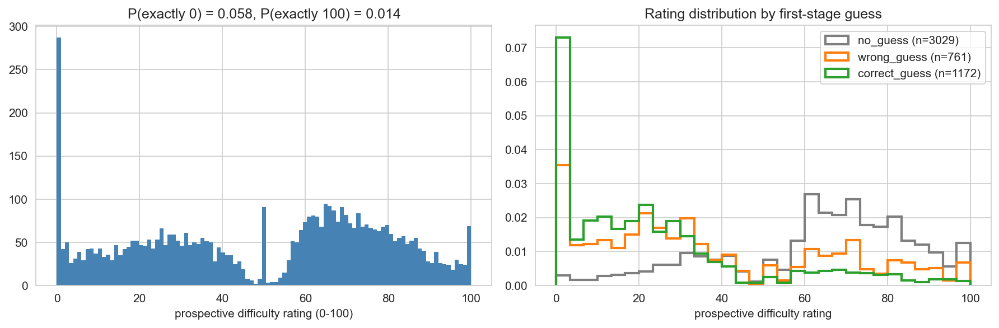
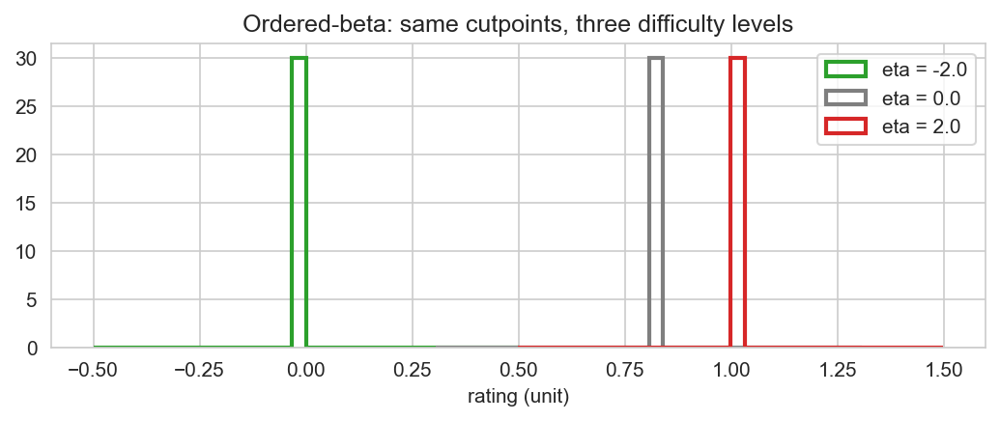
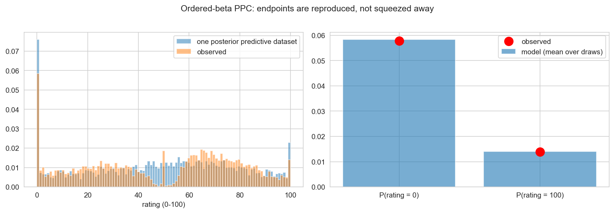
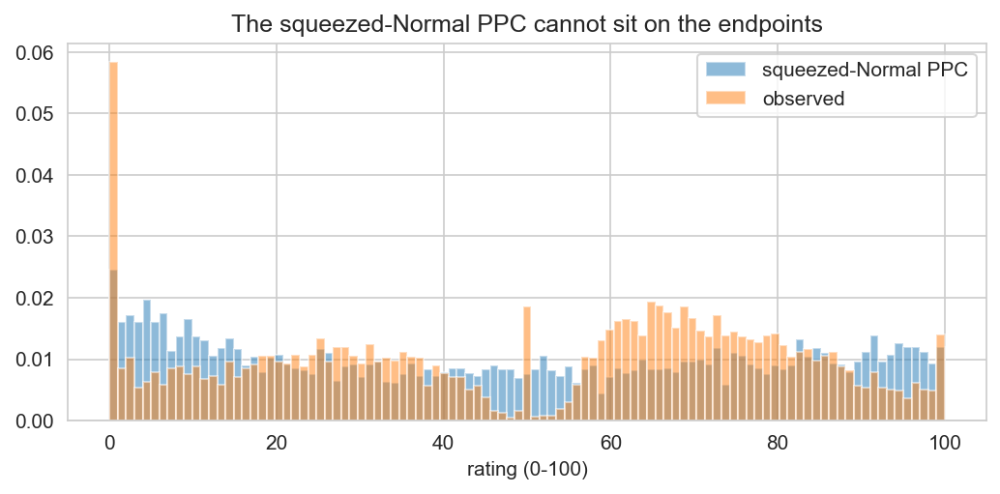
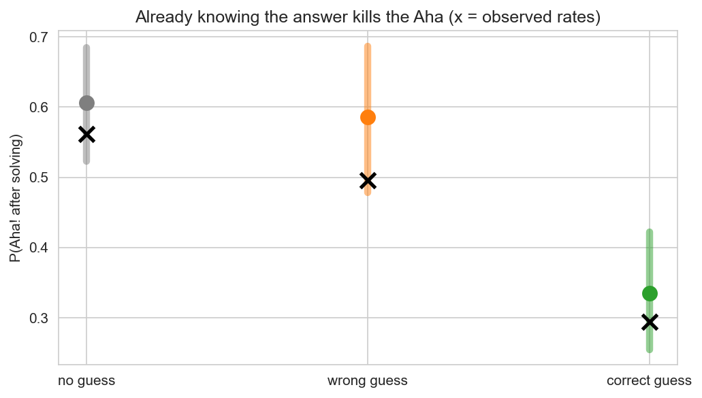

# Case Study: Rated Difficulty on a 0–100 Slider — the Ordered-Beta Model

[](https://colab.research.google.com/github/iknyazeva/bayes-cogsci-book/blob/main/case_studies/CaseStudies.CRAT.ipynb)

*When the most common data type in psychology — the bounded rating — meets the likelihood it
deserves. Including writing that likelihood yourself in PyMC.*

```{admonition} What this chapter is
:class: tip
A **worked case study** from the Moroshkina-lab CRAT (compound remote associates) project,
Study 2: **101 participants × 60 word triads, fully crossed (6,060 trials)**, re-implemented
in PyMC 5. The full executable code lives in the companion interactive notebook; all figures
below are generated by it.
```

**Prerequisites.** GLMs & link functions (Session 9), hierarchical models (Session 10),
model checking (Session 11).

---

## 1. The research question

A compound remote associate triad like *BLACK – HIGH – SEA* has a one-word associate
(*WATER*). The experiment probes **metacognition**: before trying to solve a triad,
participants rate how difficult it *feels* (prospective difficulty, 0–100 slider) and may
type a spontaneous guess; then they solve it, rate how hard it *was* (retrospective), and
report an Aha! experience.

Two questions structure the analysis:

* **Q1 (metacognition).** What makes a triad *feel* hard before you solve it — its type
  (convergent vs divergent), whether you already have a guess, and objective triad
  properties (word frequency, normed solvability)?
* **Q2 (insight).** What precedes an Aha! after the solution? Does having guessed correctly
  at stage 1 — already knowing, in effect — destroy the insight experience?

The design is a **fully crossed 101 × 60 lattice**: every participant rated every triad.
Trials cluster in participants *and* in triads — crossed random effects, again.

---

## 2. The data insist on a boundary-aware likelihood

*Figure CS-E.1 — Left: the prospective-rating histogram. Right: rating distributions by
first-stage guess state.*



Two facts break every default likelihood:

1. **Point mass at the endpoints**: ≈ 5.8 % of ratings are exactly 0 ("I know this") and
   ≈ 1.4 % exactly 100 ("impossible"). A Normal assigns zero density to both; a plain Beta
   cannot put mass *on* a point.
2. **The shape moves with covariates** — triads you guessed correctly have their whole
   distribution shifted toward easy.

The conventional hack — squeeze with `z = logit((y + 0.5)/101)` and fit a Normal — quietly
maps distinct behaviors onto nearby z-values and yields predictive datasets that touch the
boundaries only by luck.

---

## 3. The ordered-beta distribution

One continuous location $\eta$ drives three latent pieces {cite}`kubinec2023`:

$$P(0) = 1 - \sigma(\eta - k_0), \qquad P(100) = \sigma(\eta - k_1), \qquad
y \mid 0 < y < 100 \;\sim\; \operatorname{Beta}\big(\sigma(\eta)\phi,\; (1-\sigma(\eta))\phi\big)$$

The cutpoints $k_0 < k_1$ are **estimated** — the model learns how boundary-happy the
population is — and $\phi$ is a precision parameter, which we will let depend on covariates
(a *distributional* regression).

*Figure CS-E.2 — Simulated ordered-beta densities at three difficulty levels under one set
of cutpoints: mass migrates to the "0" boundary as $\eta$ falls.*



```{admonition} Writing a custom distribution in PyMC
:class: tip
A likelihood PyMC does not ship becomes a `pm.CustomDist`: hand it a `logp` (pytensor,
differentiable) and — if you want honest posterior predictive checks — a matching `random`
generator (numpy). The two must agree *exactly*; the notebook's §2 shows both, and exercise 4
shows what a PPC looks like when they don't.
```

---

## 4. The prospective-difficulty model

$$y_i \sim \operatorname{OrderedBeta}(\eta_i, k_0, k_1, \phi_i)$$
$$\eta_i = \beta_0 + \boldsymbol{\beta}^{\!T}\mathbf{x}_i + u_{p(i)} + w_{t(i)}, \qquad
\log \phi_i = \gamma_0 + \boldsymbol{\gamma}^{\!T}_{\text{guess}} \mathbf{x}^{\phi}_i + v_{p(i)}$$

* **Predictors of the mean** $\eta$: triad type, guess state dummies (correct / wrong),
  type × guess interactions, associate frequency, normed CRAT solvability.
* **Precision** $\phi$ varies by guess state and by participant — some people use the whole
  slider, some hug a region; a *response-style* nuisance modeled instead of resquashed.
* Crossed non-centered intercepts: participant $u_p$, triad $w_t$.

| Effect on $\eta$ | mean [94% HDI] | reading |
|---|---|---|
| correct guess | ≈ −1.45 [−1.52, −1.38] | **already knowing makes the triad feel much easier** |
| wrong guess | ≈ −1.02 [−1.10, −0.94] | any guess helps a little less |
| type (divergent +0.5) | ≈ +0.10 | divergent triads feel harder |
| frequency | ≈ −0.06 per SD | frequent associates feel easier |
| CRAT solvability | ≈ −0.03 per SD | normed ease carries into feeling |
| $\sigma_{\text{participant}}$ vs $\sigma_{\text{triad}}$ | ≈ 0.53 vs ≈ 0.09 | **persons vary far more than items** |

*Figure CS-E.3 — Ordered-beta PPC: a replicated dataset reproduces the observed histogram
(left), and the model's P(rating = 0) and P(rating = 100) match the observed boundary masses
(right) — endpoints are modeled, not squeezed away.*



*Figure CS-E.4 — The squeezed-Normal comparison: its predictive datasets pile up near, but
never on, the endpoints. The likelihood choice is visible in the PPC, not in the
coefficients.*



```{admonition} Observed states instead of latent mixtures
:class: tip
An earlier modeling direction represented the rating distribution as a **mixture** of
easy/hard response regimes with latent weights. The project's documented conclusion: the
mixture mostly rediscovered the *observed* guess states, at real computational cost. Modeling
guess state directly — as we do here — is more interpretable, cheaper, and leaves mixtures
as a sensitivity check. Prefer measured states to latent ones when the measurement exists.
```

---

## 5. Aha! after the solution

Among correctly solved triads: hierarchical logistic regression for P(Aha) with the same
crossed structure, predictors = prospective difficulty's prediction error (`mist`), guess
state, solution duration, triad type.

| Effect (log-odds) | mean [95% HDI] |
|---|---|
| correct first-stage guess | ≈ −1.12 [−1.39, −0.84] |
| wrong first-stage guess | ≈ −0.08 [−0.46, +0.29] |
| log solution duration | ≈ +0.42 [+0.26, +0.58] |
| prediction error (mist) | ≈ +0.16 [+0.04, +0.28] |
| divergent type | ≈ +0.59 [+0.29, +0.90] |

*Figure CS-E.5 — Model-implied P(Aha) by first-stage guess state (everything else at its
mean; crosses = observed rates).*



The clean effect: **already knowing the answer halves the insight experience** —
P(Aha) ≈ 0.34 after a correct guess vs ≈ 0.59–0.61 otherwise, reproducing the lab's
estimates (0.335 [0.254, 0.423] vs 0.604/0.584). Harder-won solutions (longer duration,
divergent triads, larger expectation violations) feel more insightful.

---

## 6. Conclusions

1. **The slider's endpoints are data, not dirt.** The exact-0 mode is largely "I have the
   answer" — and the ordered-beta models it as such, with PPCs that actually look like the
   data.
2. **Prospective metacognition is good**: guesses and objective triad properties both track
   felt difficulty, and persons vary in $\eta$ six times more than triads do.
3. **Insight needs resistance**: correct prior guesses sharply reduce Aha; longer solves and
   bigger prospective-surprise raise it.
4. **Custom likelihoods are within reach**: a `logp` + `random` pair turns a paper's model
   into a first-class PyMC citizen.

### Exercises
See the notebook's final section (LOO-prune the interactions, distributional φ by triad,
retrospective-rating model, deliberately-wrong RNG, effects on the 0–100 scale).

---

## References

* Kubinec, R. (2023). Ordered beta regression: a parsimonious, well-fitting model for
  continuous data with bounds. *Political Analysis, 31*(4), 698–715.
* Smith, R. W., & Kounios, J. (1996). Sudden insight: all-or-none processing revealed by
  speed-accuracy decomposition. *JEP: LMC, 22*(6), 1443–1462.
* Bowden, E. M., & Jung-Beeman, M. (2003). Aha! insight moment correlates with solution
  activation in the right hemisphere. *Psychonomic Bulletin & Review, 10*(3), 730–737.
* McElreath, R. (2020). *Statistical Rethinking* (2nd ed.). CRC Press.

*Data and model specification: Moroshkina-lab CRAT project (Study 2). This chapter's
notebook reproduces the lab's published Aha-model estimates within Monte-Carlo error
(e.g., guess-correct log-odds −1.12 vs the lab's −1.118; P(Aha|correct) 0.337 vs 0.335).*
