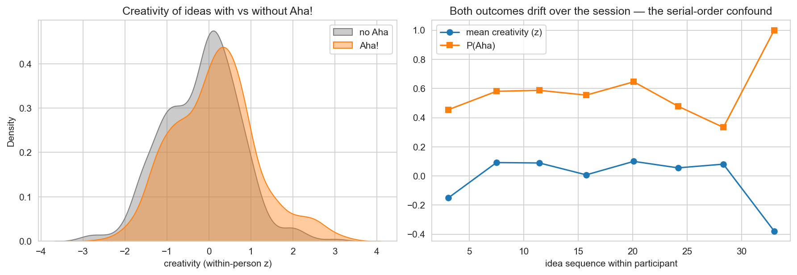
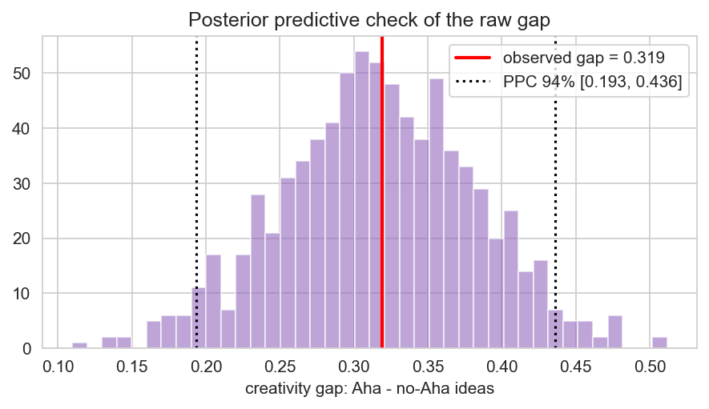

# Case Study: Do Aha! Moments Mark Creative Ideas?

[](https://colab.research.google.com/github/iknyazeva/bayes-cogsci-book/blob/main/case_studies/CaseStudies.Creativity.ipynb)

*Bayesian linear mediation with participant random effects — and a lesson in which variables
are allowed to sit on a causal path.*

```{admonition} What this chapter is
:class: tip
A **worked case study** from the Moroshkina-lab project on Aha! experiences in divergent
thinking (final `v1` analysis pipeline), re-implemented in PyMC 5. The full executable code
lives in the companion interactive notebook; all figures below are generated by it.
**N = 102 participants, 1,534 ideas.**
```

**Prerequisites.** Regression (Session 8), hierarchical models (Session 10); causal graphs
(Session 12) sharpen the mediator discussion.

---

## 1. The research question

Insight solutions arrive with a distinctive "Aha!" feeling. Folk intuition and part of the
insight literature treat that feeling as a *signal of quality*: Aha-accompanied ideas are
special. The rival, deflationary story: nothing special about the ideas — only about *when*
they appear. As a divergent-thinking session progresses, ideas become scarcer, more remote,
and both more creative and more Aha-prone; the Aha–creativity correlation could be pure
serial-order confound.

The design gets idea-level resolution: participants generate unusual uses for a newspaper;
after **each** idea they report Aha! occurrence (binary) and intensity; every idea is later
scored for **creativity** (OCSAI) and **elaboration** (richness of detail). Three
idea-level quantities, hence a natural mediation triangle:

$$\mathrm{Aha!} \longrightarrow \mathrm{Elaboration} \longrightarrow \mathrm{Creativity}$$

with idea sequence waiting in the wings as a confound.

```{admonition} Mediator or covariate? A documented correction
:class: caution
The project's first specification used idea *sequence* as the mediator
(Aha → sequence → creativity). That path is causally incoherent: the sequence index exists
**before** the idea (and therefore before its Aha) — an effect cannot travel back in time.
The final analysis demotes sequence to a **control covariate** and lets elaboration —
plausibly downstream of Aha and upstream of creativity — take the mediator seat. Rule:
**a mediator must be measurable after the cause and before the outcome.** Retaining the
broken specification as an "exploratory model" (the lab did, explicitly labeled) is good
scientific hygiene: the wrong analysis should be legible, not hidden.
```

---

## 2. Design & preprocessing

| Step | Choice | Why |
|---|---|---|
| filter | valid newspaper-task ideas only | protocol exclusions |
| cap | elaboration clipped at 30 | rambling answers stop adding information |
| standardize *within participant* | creativity, elaboration, sequence | removes scale-usage & output-volume differences; effects become "within this person, across their ideas" |
| Aha intensity | z-scored within participant on Aha trials, **0 on non-Aha trials** | the intensity dial is active only when Aha occurred |

*Figure CS-D.1 — Left: creativity distributions for Aha vs non-Aha ideas (the raw gap the
story is about). Right: both creativity and P(Aha) drift upward over the session — the
serial-order confound in one picture.*



---

## 3. Step 1 — measure the confound

Three small hierarchical regressions quantify the time trend (participant random intercepts,
non-centered):

| Model | slope [94% HDI] | P(>0) |
|---|---|---|
| sequence → creativity | ≈ +0.09 [+0.04, +0.14] | 1.00 |
| sequence → P(Aha) | ≈ +0.37 [+0.25, +0.48] (log-odds) | 1.00 |
| sequence → Aha intensity | ≈ +0.17 [+0.11, +0.23] | 1.00 |

The confound is real on all three fronts. A simple Aha → creativity regression would harvest
the shared trend; the main model must hold sequence fixed.

---

## 4. Step 2 — the mediation model

Two linked regressions, fit **jointly** (so the indirect effect inherits the full posterior
geometry, including the correlation between its two factors):

$$\mathrm{elab}_i \sim \mathcal{N}(\mu^E_i, \sigma_E), \qquad
\mu^E_i = b^E_0 + b^E_a\,\mathrm{Aha}_i + b^E_r\,\mathrm{intensity}_i + b^E_t\,\mathrm{seq}_i + u^E_{p(i)}$$

$$\mathrm{crea}_i \sim \mathcal{N}(\mu^C_i, \sigma_C), \qquad
\mu^C_i = b^C_0 + b^C_a\,\mathrm{Aha}_i + b^C_r\,\mathrm{intensity}_i + b^C_e\,\mathrm{elab}_i + b^C_t\,\mathrm{seq}_i + u^C_{p(i)}$$

$$\text{direct} = b^C_a, \qquad
\text{indirect} = b^E_a \times b^C_e, \qquad
\text{total} = \text{direct} + \text{indirect}$$

*Figure CS-D.2 — The mediation decomposition (94% HDIs) for Aha occurrence (left) and Aha
intensity (right). Green intervals exclude zero.*


| Effect | mean [94% HDI] | share of total |
|---|---|---|
| **Aha → creativity, direct** | **+0.22 [+0.12, +0.31]** | ~70 % |
| Aha → elaboration → creativity, indirect | +0.09 [+0.06, +0.12] | ~30 % |
| Aha → creativity, total | +0.31 [+0.21, +0.40] | |
| intensity → creativity, direct | +0.15 [+0.08, +0.21] | |
| intensity → elaboration → creativity | +0.05 [+0.03, +0.07] | |
| elaboration → creativity | +0.29 [+0.23, +0.33] | |
| sequence → creativity (controlled) | +0.04 [−0.01, +0.09] | not present at 0.95 |

The pre-declared decision rule — an effect is "present" when $P(\text{direction}) \ge 0.95$ —
marks every Aha-path effect present, and the *controlled* sequence effect drops below the
threshold: once Aha and elaboration are in the model, sequence explains nothing further.

*Figure CS-D.3 — Posterior predictive check: the model reproduces the raw Aha–no-Aha
creativity gap, not just the fitted slopes.*



---

## 5. Sensitivity

Refitting without the sequence covariate moves the direct Aha effect by less than 0.02 SD
(≈ +0.23 vs +0.22): the conclusion does not hinge on the serial-order adjustment — good,
because that adjustment's job is only to block the confound, not to carry the effect.

---

## 6. Conclusions

1. **Aha! ideas are genuinely more creative** — about a fifth of a within-person standard
   deviation, controlling for serial position and elaboration, with $P(>0) = 1.00$.
2. **Roughly a third of the effect flows through elaboration**: Aha ideas are *richer*
   ideas, and richer ideas score higher.
3. **Intensity adds information beyond occurrence** (+0.15 SD direct): the feeling has
   gradations that track creativity.
4. The deflationary account fails: the serial-order trend is real but is *not* the Aha
   effect.

### The workflow, as rehearsed here

| Stage | Where |
|---|---|
| Confound measured before adjustment | §3 small models |
| Causal roles fixed before formulas | mediator vs covariate correction |
| Idea-level nesting respected | participant random intercepts |
| Effects on a interpretable scale | within-person SDs |
| Joint uncertainty over derived quantities | indirect = product, from the joint posterior |
| Pre-declared decision rule | $P \ge 0.95$, stated in advance |
| Sensitivity to the adjustment | §5 no-trial refit |
| PPC on the raw contrast | Fig. CS-D.3 |

### Exercises
See the notebook's final section (broken-mediation demonstration, reversed triangle,
participant Aha-slopes, LOO vs covariate adjustment, design simulation).

---

## References

* Baron, R. M., & Kenny, D. A. (1986). The moderator–mediator variable distinction.
  *J. Pers. Soc. Psychol., 51*(6), 1173–1182.
* Imai, K., Keele, L., & Tingley, D. (2010). A general approach to causal mediation analysis.
  *Psychological Methods, 15*(4), 309–334.
* Runco, M. A., & Jaeger, G. J. (2012). The standard definition of creativity.
  *Creativity Research Journal, 24*(1), 92–96.
* Webb, M. E., Little, D. R., & Cropper, S. J. (2018). Insight is not in the problem.
  *QJEP, 71*(6).
* McElreath, R. (2020). *Statistical Rethinking* (2nd ed.). CRC Press.

*Data and the final `v1` pipeline: Moroshkina-lab Aha/Creativity project. This chapter's
notebook reproduces its published effect tables within Monte-Carlo error.*
