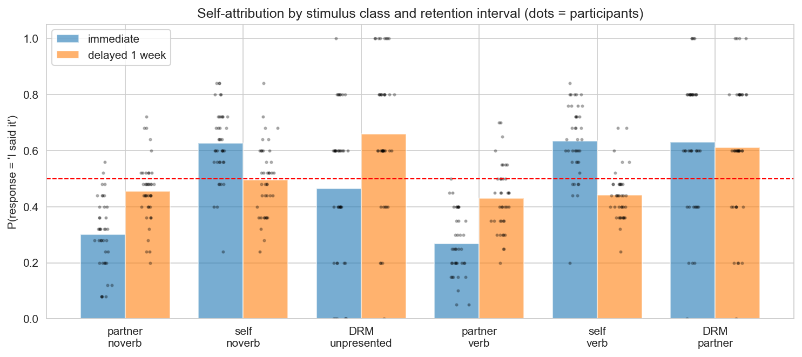
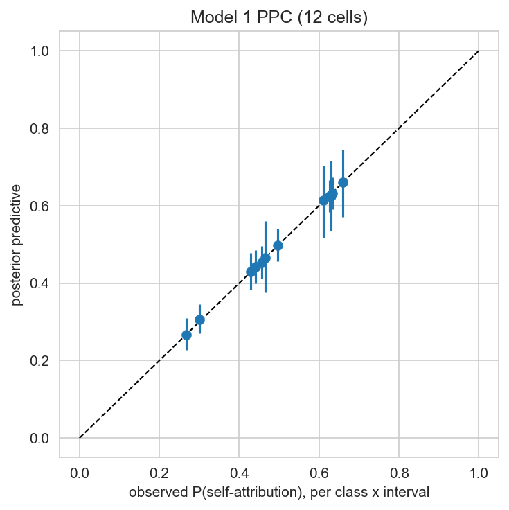
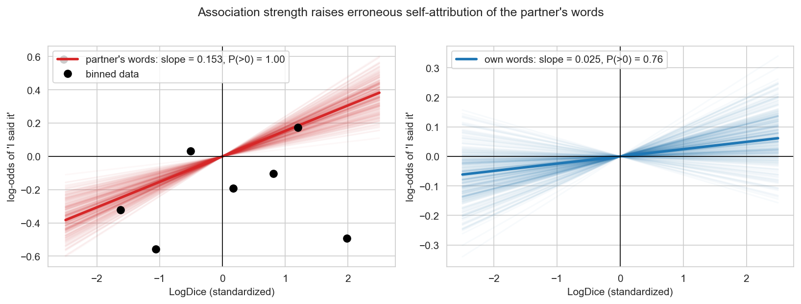
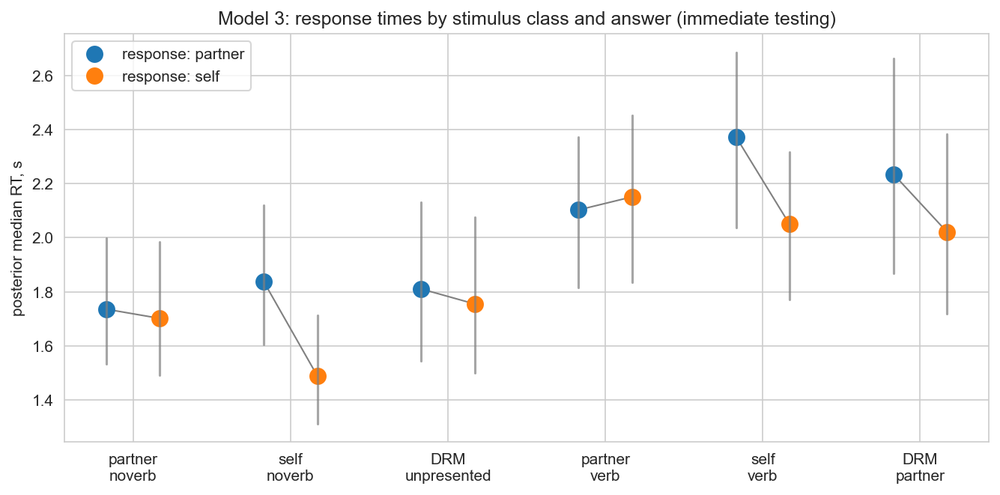

# Case Study: Cryptomnesia — Unconscious Plagiarism in a DRM Dialogue

[](https://colab.research.google.com/github/iknyazeva/bayes-cogsci-book/blob/main/case_studies/CaseStudies.Cryptomnesia.ipynb)

*Hierarchical Bayesian logistic regression with three crossed random effects.*

```{admonition} What this chapter is
:class: tip
A **worked case study** built on the Gershkovich lab's cryptomnesia project: Popova's original
SPbSU diploma experiment (2017; also reported in Gershkovich & Popova, CogSci 2017 materials) plus
three replication samples — **159 participants, 8,350 trials, 4 experiments** — re-analyzed with
the lab's Bayesian PyMC 5 models, re-implemented in teaching form. The full executable code lives
in the companion interactive notebook; all figures below are generated by it.
```

**Prerequisites.** Logistic regression (Session 9), hierarchical models & crossed random effects
(Session 10), model checking & comparison (Session 11).

---

## 1. The research question

**Cryptomnesia** — literally "hidden memory" — is the unintentional appropriation of someone
else's idea as one's own. The classic anecdotes are self-accusations by Poincaré and Darwin, each
of whom suspected a colleague of plagiarism only to discover their own earlier writing
{cite}`newton1980`. The laboratory version asks: *what makes a memory feel mine?*

Source monitoring theory says attributing a memory to a source ("I said it" vs "Misha said it")
uses both *content* (familiarity, semantic richness) and *context* (when/how it was encountered).
Cryptomnesia should therefore be boosted by anything that raises **familiarity without context**:
delay (context fades, familiarity lasts), and **semantic association** to the studied material.

The experiment combines a turn-taking dialogue with the **DRM paradigm**
{cite}`roediger1995`: five 10-word lists whose associates converge on a never-presented *critical*
word (море, гора, книга, сон, стул). Participants alternate reading words with an experimenter's
voice ("Misha"), then at test judge each word — theirs, Misha's, or never presented — with one
binary response: **"I said it" / "Misha said it."**

| Question | Mechanism tested |
|---|---|
| Q1 | Are never-presented DRM lures claimed as **one's own** more than Misha's real words? |
| Q2 | Does a 1-week **delay** amplify this? Does Misha **verbalizing** the lure change it? |
| Q3 | Does a word's corpus **association strength** (LogDice) to the lure predict erroneous self-attribution? |
| Q4 | Do **response times** carry an independent signature? |

---

## 2. Design

Between-subject factors: retention **interval** (immediate vs 1 week) and **verbalization**
(whether Misha ever said the critical lure aloud during the dialogue). Four experiments pool into
one analysis:

| Experiment | N | Intervals | Verbalization |
|---|---|---|---|
| Попова_д (original, 4 groups × 20) | 80 | 0 & 1 | 0 & 1 |
| Попова_к (replication) | 40 | 0 & 1 | 0 |
| бурлан_д | 19 | 1 | 1 |
| лг_доп | 20 | 0 | 1 |

Every trial's stimulus falls into one of **six classes** — the cross of {ordinary partner word,
ordinary own word, critical DRM lure} × {lure never verbalized, lure verbalized}:

| # | class | the reference question it answers |
|---|---|---|
| 0 | `ordinary_partner_noverb` | how often is Misha's real word claimed? (reference) |
| 1 | `ordinary_self_noverb` | how often are one's own words correctly claimed? |
| 2 | `critical_unpresented` | **the pure cryptomnesia cell: a word nobody ever said** |
| 3 | `ordinary_partner_verb` | control for verbalization context |
| 4 | `ordinary_self_verb` | control for verbalization context |
| 5 | `critical_partner` | the lure **Misha actually said aloud** — is it still stolen? |

---

## 3. What the raw data show

*Figure CS1.1 — P(response = "I said it") by stimulus class and interval; dots are participant-level
means. Reference line at 0.5. The two DRM classes (3rd and 6th groups) sit far above the partner
classes even though nobody ever said those words.*



Three raw patterns worth noting before any model:

1. Own words: claimed ~0.6–0.8 (correct).
2. Partner's ordinary words: mostly *denied* (~0.28 immediate → ~0.44 delayed) — there is **no
   global bias** toward answering "I said it"; if anything the bias runs the other way.
3. DRM lures: intermediate immediately, climbing with delay — the signature of cryptomnesia.

But each participant contributes dozens of trials, lists differ in lure strength, and experiments
ran at different times. Comparing cells while pretending trials are independent would
dramatically overstate confidence — the hierarchical model exists to do this honestly.

---

## 4. Model 1 — one logistic regression for attribution

$$y_i \sim \operatorname{Bernoulli}(p_i)$$
$$\operatorname{logit}(p_i) = \underbrace{\alpha_{j[i]} + \delta_{m[i]} + \gamma_{e[i]}}_{\text{crossed random intercepts}} + \beta_t t_i + \sum_{k=1}^{5}\beta_k u_{ik} + \sum_{k=1}^{5}\omega_k\, u_{ik} t_i$$

* $u_{ik}$ — treatment dummies for the five non-reference classes;
* $t_i$ — interval (0/1); $\omega_k$ lets delay act *differently per class*;
* **three crossed random intercepts**: participant (159), DRM list (5), experiment (4), all
  non-centered.

```{admonition} Why *crossed* random effects?
:class: tip
Trials nest in participants, but also in word lists (the lure *сон* is stronger than *стул*) and in
experiments (replications differ in years and instructions). These groupings do not nest inside
each other — a participant belongs to one experiment but to all five lists. "Crossed" simply means
the grouping factors are independent dimensions of the same trials, each with its own varying
intercept.
```

Sampling: 4 chains × 1,500 draws; max $\hat R \approx 1.005$, 7 post-tuning divergences out of
6,000 draws — a harmless fraction, but exactly the kind of thing you only see if you actually
*look* at the diagnostics.

*Figure CS1.2 — Posterior cell probabilities with 94% HDIs (lines), posterior medians (dots) and
raw observed rates (crosses): the model tracks the data and quantifies each cell's uncertainty.*


### 4.1 The contrasts that answer the questions

Computed as differences of posterior cell *probabilities* — the natural, decision-relevant scale:

| Contrast | Immediate | Delayed | Reading |
|---|---|---|---|
| `critical_unpresented − partner` | ≈ +0.16, P(>0) ≈ 1.00 | ≈ +0.21, P(>0) = 1.00 | **Q1: yes** — never-said words are claimed above Misha's real words |
| `critical_unpresented − self` | ≈ −0.16, P(<0) = 1.00 | **≈ +0.16, P(>0) = 1.00** | after a week the lure passes **one's own real words** |
| `critical_partner − partner_verb` | ≈ +0.35, P(>0) = 1.00 | ≈ +0.18, P(>0) = 1.00 | **Q2: even a lure Misha actually said is still stolen** |
| partner (delayed − immediate) | — | ≈ +0.14 | delay alone already blurs source for ordinary words |

*(Exact values in the notebook's contrast table; they reproduce the lab's reported results.)*

```{admonition} Reading probabilities, not just signs
:class: tip
"Immediate" DRM self-attribution is ≈ 0.46–0.47 with a 94% HDI straddling 0.5 — *at chance*.
The interesting comparison is not with the number 0.5 but with the partner baseline ≈ 0.28:
the lure is claimed ~1.5× more often than Misha's real words from the very start.
```

*Figure CS1.3 — Posterior predictive check: observed vs simulated self-attribution rate per
class × interval cell (94% intervals). Points hug the diagonal.*



---

## 5. Model 2 — the association-strength mechanism (LogDice)

If cryptomnesia is familiarity-through-association, each ordinary word's **LogDice** — its
corpus co-occurrence strength with its list's critical lure — should predict erroneous
self-attribution. Crucially, this should hold for **Misha's words** (which can be stolen) but
saturate for one's **own words** (already claimed). The model adds to the source-monitoring
factorial:

$$\operatorname{logit}(p_i) = (\ldots) + \beta_{ld}\, l_i + \beta_{ld\times self}\, s_i\, l_i$$

*Figure CS1.4 — Posterior LogDice slopes for the partner's words (left) vs own words (right);
black dots are binned raw log-odds. Association strength selectively raises erroneous
self-attribution of **other people's** words.*



Result (94% HDI): slope for partner words ≈ **+0.15** [0.08, 0.22], P(>0) = 1.00; for own words
≈ 0.03 [−0.04, 0.09] — the interaction $\beta_{ld \times self} \approx -0.13$ is itself credible.
This is exactly the familiarity-misattribution signature: association strength pulls *other
people's* words toward "mine", while one's own words are at ceiling.

---

## 6. Model 3 — response times

The same six classes with a hierarchical Normal model on $\log \mathrm{RT}$
(`class × response × interval`):

*Figure CS1.5 — Posterior median RT (s) per class for the two answers (immediate testing). The
stable signal: self-consistent answers to one's own words are fastest; DRM classes show no
reliable RT marker.*



RT effects are weaker and less structured than attribution effects — a useful negative result:
the cryptomnesia signature here is **categorical**, not speed-based.

---

## 7. Conclusions

| Question | Finding |
|---|---|
| Global "I said it" bias? | **No** — ordinary partner words are denied |
| Never-said DRM word claimed above partner's words? | **Yes**, and stronger after a week |
| ...above one's own words after a week? | **Yes** |
| Lure said aloud by Misha still claimed? | **Yes** |
| Association strength mechanism? | **Yes** — selective for partner's words |
| RT signature? | Weak; fastest self-responses for own ordinary words |

**The big picture.** Cryptomnesia here is not a response bias — it is *selective for semantically
central material*, graded by corpus association strength, amplified by delay, and immune to the
lure having actually been spoken by the partner. Familiarity is being misread as authorship.

---

## 8. The Bayesian workflow, as rehearsed here

| Stage | Where |
|---|---|
| Theory → observables | six stimulus classes from source-monitoring theory |
| Structure all replication levels | participant/list/experiment crossed intercepts |
| Contrast on the decision scale | probability differences, P(direction) |
| Mechanism via a stimulus property | LogDice × source interaction |
| Convergent validity across measures | attribution + RT models |
| Report the nulls honestly | no global self-bias; no stable DRM RT marker |

---

## 9. Exercises

1. Re-center the treatment coding on `critical_unpresented` and re-express every contrast.
2. Add list-level LogDice of the lure itself (море vs стул) — do some lists "steal" more?
3. Compute a Savage–Dickey Bayes factor for $\beta_{ld} = 0$.
4. Replace the participant intercept with intercept + lure-sensitivity slope (per participant) —
   do "stealers" and "non-stealers" separate?
5. Model source *discrimination* (accuracy on ordinary trials) and test whether better monitors
   steal less.

---

## 10. Notes on this adaptation

The lab's original analysis code defines four models via
`fit_*` functions with artifact saving; this chapter keeps three of them (unified attribution,
LogDice, unified RT) with identical priors and coding, adds a PPC, and re-derives the contrasts
published in the lab's analysis report. Parameter estimates reproduce the lab's within Monte-Carlo
error — e.g. `critical_unpresented − partner` immediate +0.159 [0.090, 0.229] vs lab +0.158
[0.093, 0.226]; LogDice slope +0.153 [0.081, 0.225] vs lab +0.154 [0.079, 0.220]; the RT
self-consistency advantage for own words −0.347 s vs lab −0.343 s.

---

## 11. References

* Roediger, H. L., & McDermott, K. B. (1995). Creating false memories. *JEP: LMC, 21*(4), 803–814.
* Brown, A. S., & Murphy, D. R. (1989). Cryptomnesia: Delineating inadvertent plagiarism.
  *JEP: LMC, 15*(3), 432–442.
* Newton, E. M., & Newton, P. M. (1980). The case of the plagiarism. *Psychology of Music*.
* Johnson, M. K., Hashtroudi, S., & Lindsay, D. S. (1993). Source monitoring.
  *Psychological Bulletin, 114*(1), 3–28.
* McElreath, R. (2020). *Statistical Rethinking* (2nd ed.). CRC Press.
* Popova, A. S. (2017). Diploma thesis, SPbSU (supervisor: V. A. Gershkovich); Bayesian reanalysis:
  Gershkovich lab.
