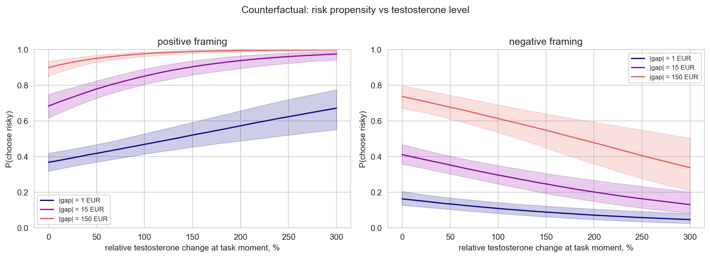
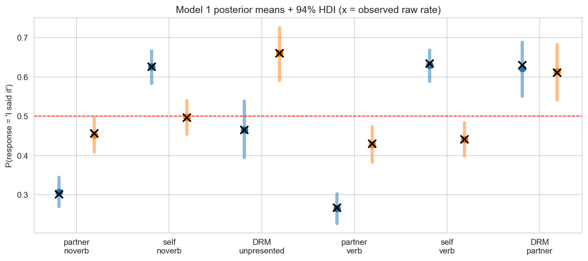
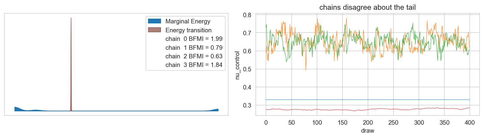
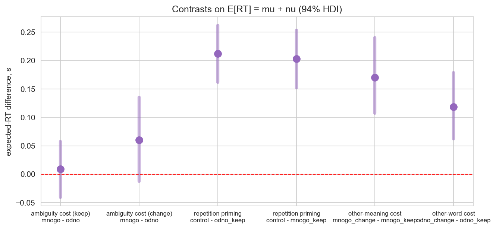
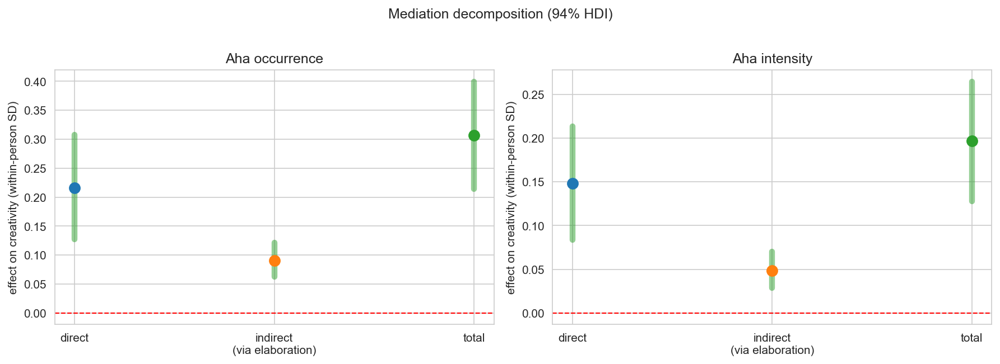

# Case Studies

*Statistics is learned forward and applied backward.* The sessions of this book teach one tool at a
time — priors, then posteriors, then hierarchies, then diagnostics. Real analysis runs in the
opposite direction: you meet a messy experiment and must decide *which* tools, *in which order*, and
*what a result even means*. This part of the book presents real empirical analyses — hormone
pharmacology, memory misattribution, response-time modeling, creative insight, and bounded
rating scales — each carried from raw data to scientific conclusion in PyMC, and each deliberately chosen to showcase a different family of
modeling decisions.

```{admonition} How to use this part
:class: tip
Each case study is presented with its complete modeling narrative, diagnostic checks, and scientific reasoning, accompanied by executable computational notebooks. Read the chapter first to follow the substantive logic and model progression; explore the companion notebook to inspect every step, test alternative priors, and run the sampler.

| Case study | Outcome | The one clever idea |
|---|---|---|
| [A. Testosterone & risk-taking](#case-a) | binary choices | a psychological **theory (CPT) compressed into a regressor** |
| [B. Cryptomnesia](#case-b) | binary attributions | **three crossed random effects** + probability-scale contrasts |
| [C. Semantic ambiguity & RT](#case-c) | response times | the **likelihood as theory** (ExGaussian), and a convergence rescue |
| [D. Aha! & creativity](#case-d) | idea scores | **Bayesian mediation** with the causal mediator/covariate discipline |
| [E. CRAT difficulty ratings](#case-e) | 0–100 slider | **ordered-beta** with boundary mass — writing a custom PyMC likelihood |
```

**Prerequisites.** Everything through Session 11 (GLMs, hierarchies, diagnostics). Each case study
lists its own prerequisites in more detail.

---

## Why case studies?

A finished paper shows the model that worked. A finished *analysis* contains everything the paper
hides: the descriptives that suggested the model, the models that lost the comparison, the sampler
that refused to converge, the borderline interval you had to word carefully. The five studies in
this part were chosen because together they exercise the full craft:

| Decision | Exercised in |
|---|---|
| Turning theory into a regressor | A (CPT gap), B (LogDice) |
| Choosing the likelihood | A (Bernoulli, lognormal), B (Bernoulli, Normal on log-RT), C (ExGaussian vs Normal) |
| Treatment dummy vs measured dose | A ($T_{change}$ from blood serum) |
| Which grouping factors get random effects | B (participant/list/experiment), C (participant/stimulus) |
| Correlated subject-level parameters | A (`LKJCholeskyCov`) |
| Estimating what your design cannot identify | A (CPT α, c anchored to open replication data) |
| Diagnostics you must act on | C (a real catastrophe: $\hat R = 2.9$, ESS = 5) |
| Evidence *for* a null | A (endowment), B (no global self-bias) |
| Honest borderline reporting | A ($\delta\beta$ barely excluding 0), C (ambiguity cost P = 0.94) |
| Counterfactual prediction | A (what testosterone *would* do), C (effects in seconds) |
| Mediation & causal role of covariates | D (sequence demoted from mediator) |
| Bounded outcomes with boundary mass | E (ordered-beta, custom `CustomDist`) |
| Distributional regression (precision φ) | E |
| Observed states instead of latent mixtures | E (guess states) |
| Within-participant standardization | D |


---

(case-a)=
## Case A: Testosterone & Risk-Taking

**Full chapter:** [Case A: Testosterone, Risk-Taking & the Endowment Effect](CaseStudies.TestosteroneRiskEndowment.md)
*(Votinov, Knyazeva, Habel, Konrad & Puiu, 2022, *Front. Neurosci.* 16:858168 — re-analyzed in PyMC 5)*

**Problem.** Forty men performed a risk-taking task (risky gamble vs sure option, gain and loss
framings) and an endowment task (WTA/WTP prices for hedonic vs utilitarian goods), once under a
100 mg testosterone gel and once under placebo (double-blind cross-over), with serum hormone
samples at the task moment.

**The clever idea.** Do not model "choices vs condition". Compress **cumulative prospect theory**
into a single regressor — the subjective value difference between the options,
$\mathrm{logGap} = \operatorname{sign}(V(A)-V(B))\log(1+|V(A)-V(B)|)$ — and let a hierarchical
logistic regression estimate how *shift* (sure-option preference) and *sensitivity* (gap
responsiveness) depend on the **measured** hormonal change $T_{change,i}$, per framing:

$$\operatorname{logit}(p_i) = \big(a_F + \delta^a_F T_{change,i}\big) + \big(b_F + \delta^b_F T_{change,i}\big)\,\mathrm{logGap}_i$$

with subject-level (shift, beta) vectors correlated through one LKJ prior. The CPT curvature
parameters are *anchored* to an open replication dataset (Nilsson et al., 2011) rather than
estimated from 5 trials per cell — and §5.6 of the notebook re-runs the model with re-estimated
anchors to show the conclusions don't move.

**The result.**

*Figure CS.0.1 — The four testosterone-related coefficients (94% HDIs). The headline:
$\delta\beta_{Gain} = +0.27$ [0.00, 0.52] — under testosterone, choices follow gain differences
more strongly. Under losses the direction reverses (shift toward the sure option).*


*Figure CS.0.2 — Counterfactual predictions: model-implied risky-choice probability as a function
of relative testosterone change for three stake levels. The sign of the hormonal effect depends on
framing and stake — which is why a parameterized model beats a t-test on choices.*



| Finding | Value | Paper? |
|---|---|---|
| gain-sensitivity under testosterone | +0.27 [0.00, 0.52] (odds 1.31/unit) | reproduced (Table 2) |
| ROC-AUC, pooled → hierarchical | 0.77 → 0.94 | reproduced |
| endowment effect | ratio ≈ 1.14, categories credible | reproduced |
| testosterone → endowment | ≈ +3 % at median change, no item credible | reproduced (with nuance) |

*Figure CS.0.3 — Posterior predictive calibration: observed vs predicted risky-choice rate per
game × condition (94% intervals).*


---

(case-b)=
## Case B: Cryptomnesia — Unconscious Plagiarism

**Full chapter:** [Case B: Cryptomnesia — Unconscious Plagiarism](CaseStudies.Cryptomnesia.md)
*(Gershkovich lab: Popova 2017 diploma + 3 replications, N = 159, 8,350 trials)*

**Problem.** Participants alternate reading words with a virtual partner ("Misha"), then judge each
word — theirs, Misha's, or a never-presented DRM critical lure (море, гора, …) — with one binary
response: *"I said it"* or *"Misha said it."* Is the lure stolen? Does delay amplify the theft?
Does association strength predict it?

**The clever idea.** One logistic regression over **six theory-generated stimulus classes**
(partner/self/DRM × lure-never/ever-verbalized), crossed by interval — and crucially, **three
crossed random intercepts** for the three ways trials cluster:

$$\operatorname{logit}(p_i) = \alpha_{j[i]} + \delta_{m[i]} + \gamma_{e[i]} + \beta_t t_i
+ \sum_k \beta_k u_{ik} + \sum_k \omega_k u_{ik} t_i$$

Participants (159) nest trials; but lists (5) and experiments (4) cut *across* participants —
grouping factors that do not nest are "crossed", and each needs its own varying intercept.
Scientific claims are then **differences of probabilities** (e.g. $P(\text{self} \mid \text{DRM})
- P(\text{self} \mid \text{partner's word})$) computed draw-by-draw from the posterior.

**The result.**

*Figure CS.0.4 — Posterior self-attribution per class × interval (94% HDIs; crosses = raw rates).
The two DRM classes — words nobody ever said — climb above the partner's real words and, after a
week, above the participant's own real words.*



| Contrast (probability difference) | Value | Verdict |
|---|---|---|
| DRM unpresented − partner (immediate) | +0.159 [0.090, 0.229], P = 1.00 | stolen from the start |
| DRM unpresented − **self** (delayed) | +0.163 [0.093, 0.228], P = 1.00 | passes one's own words |
| DRM said by Misha − partner's word | +0.356 imm / +0.185 delayed | still stolen |
| global "I said it" bias | absent (partner words denied) | null, reported |

*Figure CS.0.5 — The mechanism: corpus association strength (LogDice) raises erroneous
self-attribution of the **partner's** words (left) but not one's own (right) — familiarity being
misread as authorship.*


---

(case-c)=
## Case C: Semantic Ambiguity and Response Times

**Full chapter:** [Case C: Semantic Ambiguity & Response Times](CaseStudies.AmbiguityRT.md)
*(Gershkovich lab, 2026 experiment: 73 participants, 2,294 RTs)*

**Problem.** After priming one meaning of an ambiguous word (*коса*), is responding to the
**other** meaning delayed (negative priming)? And is the delay in the *center* or the *tail* of
the RT distribution?

**The clever idea.** Make the likelihood itself the theory. RT data are skewed (skewness = 2.4);
the **ExGaussian** splits them into a Gaussian body ($\mu$, $\sigma$ — decision/motor core) and an
exponential tail ($\nu$ — attentional lapses). Give each condition its own shift on **both**
components, with crossed participant × stimulus intercepts — and then every contrast can be
reported in seconds and *decomposed*: repetition priming turned out to be almost purely a tail
effect ($\Delta\nu$, P = 1.00) with $\Delta\mu \approx 0$.

**The cautionary tale.** The lab's first version put the participant deviations on the tail and
enforced positivity with a hard `switch` floor. Result — reproduced deliberately in the notebook:

*Figure CS.0.6 — The catastrophe: mismatched chain energies (left) and four chains exploring
different levels of the baseline tail $\nu_0$ (right). Max $\hat R = 2.93$, min ESS = 5.*



Hard constraints are gradient killers; the rescue (effects on $\mu$, data-driven KDE priors,
`pm.ZeroSumNormal`, no floor) converges at $\hat R = 1.002$ and reproduces the lab's estimates.
LOO then prefers the ExGaussian over a Normal likelihood by Δ elpd ≈ 1,038 — as decisive as model
comparison gets.

*Figure CS.0.7 — Contrasts on expected RT $\mu + \nu$, in seconds (94% HDIs). Switching to the
other meaning of an ambiguous word costs +0.17 s vs +0.12 s for a new unambiguous word; the direct
ambiguity increment is +0.06 s with P(>0) = 0.94 — honestly "promising, not yet conclusive".*



---

---

(case-d)=
## Case D: Do Aha! Moments Mark Creative Ideas?

**Full chapter:** [Case D: Aha! Moments & Creativity](CaseStudies.Creativity.md)
*(Moroshkina lab: N = 102 participants, 1,534 ideas)*

**Problem.** Ideas reported with an "Aha!" feel more creative — but both creativity and Aha!
rise over a brainstorming session. Is the Aha–creativity link anything beyond serial order?

**The clever idea.** A **Bayesian mediation triangle** at the idea level —
Aha → elaboration → creativity — with the serial-order trend *demoted* from mediator to control
covariate after a documented causal correction (the sequence index precedes Aha, so it cannot
sit downstream of it). Effects on within-person-standardized scores; a pre-declared decision
rule ($P \ge 0.95$).

*Figure CS.0.8 — The mediation decomposition: direct, indirect (via elaboration) and total
effects of Aha occurrence and intensity (94% HDIs). All paths present at the 0.95 rule — even
controlling for serial position.*



| Effect | Value |
|---|---|
| Aha → creativity, direct | +0.22 [+0.13, +0.31] SD |
| Aha → elaboration → creativity | +0.09 [+0.06, +0.12] (≈ 30 % of total) |
| sequence → creativity (controlled) | +0.04 [−0.01, +0.09] — not present |

---

(case-e)=
## Case E: Rated Difficulty on a 0–100 Slider — the Ordered-Beta Model

**Full chapter:** [Case E: CRAT & the Ordered-Beta Model](CaseStudies.CRAT.md)
*(Moroshkina lab: 101 participants × 60 triads, fully crossed)*

**Problem.** Prospective difficulty ratings are bounded *and* spike at the endpoints
(≈ 6 % exact zeros, ≈ 1 % exact hundreds). Every default likelihood mishandles the spikes.

**The clever idea.** The **ordered-beta** distribution [@kubinec2023] — Beta interior plus
point masses at both boundaries, one latent location $\eta$ driving all three pieces —
implemented from scratch as a `pm.CustomDist` with matched `logp` **and** `random` (so PPCs are
honest). First-stage guesses enter as *observed* states, not a latent mixture.

*Figure CS.0.9 — Ordered-beta PPC: the model reproduces both the histogram shape and the exact
boundary masses (right panel) — endpoints are modeled, not squeezed away.*


*Figure CS.0.10 — Already knowing the answer halves the insight experience: P(Aha) by
first-stage guess state (crosses = observed rates).*


| Finding | Value |
|---|---|
| correct first-stage guess on felt difficulty | ≈ −1.45 on η |
| P(Aha \| correct guess) vs no guess | 0.34 [0.25, 0.42] vs 0.60 [0.52, 0.69] |
| persons vs triads (σ on η) | 0.53 vs 0.09 — who you are ≫ what you see |

---

## Six reusable analysis moves

Distilled from the five studies — each with its minimal code shape.

### 1. Compress theory into a regressor
```python
# Case A: prospect theory -> one column
gap = value(A) * weight(p) - value(B)
df["logGap"] = np.sign(gap) * np.log1p(np.abs(gap))
```
When a theory specifies *how options are valued*, build the value difference and regress on it —
the model then estimates *how choices use values*, which is the actual research question.

### 2. Prefer the measured dose to the treatment dummy
```python
# Case A: not Test==1, but each person's pharmacokinetics
T_change = (T_testosterone_T1 - T_placebo_T1) / T_placebo_T1
```
A dummy assumes every participant got the same effective treatment; a measured covariate encodes
what actually circulated in their blood while deciding — more power, more interpretability.

### 3. Give every clustering its own intercept — crossed effects
```python
# Case B: trials cluster in participants, lists AND experiments (none nested)
logit_p = alpha[participant] + delta[list] + gamma[experiment] + fixed_effects
```
The rule: if a grouping factor indexes *repeated observations* and cuts across the other factors,
it needs a (non-centered) varying intercept, or its pseudo-replication inflates your certainty.

### 4. Let subject-level parameters correlate (when the design gives you repeats)
```python
# Case A: one LKJ prior over (shift_N, beta_N, shift_P, beta_P)
chol, corr, stds = pm.LKJCholeskyCov("chol", n=4, eta=2,
                                     sd_dist=pm.Exponential.dist(1.0))
ab = pt.dot(chol, z)          # z ~ Normal(0,1, dims=("params","PId"))
```

### 5. Put contrasts on the scale people care about
```python
# Cases A & B: probability differences, odds; Case C: seconds — never raw logits
p_drm = posterior["p_critical_unpresented_delayed"]
contrast = p_drm - posterior["p_ordinary_partner_noverb_delayed"]   # draw-by-draw
```
Report P(direction) alongside HDIs; for borderline results give the effect size at realistic
covariate values (Case A's "≈ 3 % at the median hormonal change") rather than binary language.

### 6. Trust the diagnostics enough to restructure the model
```python
# Case C: from R-hat 2.9 / ESS 5 ...
nu = pm.math.switch(nu_raw > 0.01, nu_raw, 0.01)          # hard floor: gradient killer
# ...to R-hat 1.002: smooth transforms + ZeroSumNormal + well-identified placement
z = pm.ZeroSumNormal("z_participant", sigma=1.0, shape=N_PARTICIPANTS)
```
Divergences, $\hat R$, ESS and energy plots are not bureaucracy — in Case C they were the
difference between noise and science.

### 7. Respect temporal order when naming a mediator
```python
# Case D: sequence exists BEFORE the idea's Aha -> covariate, not mediator
mu_crea = b_crea_aha * aha + b_crea_elab * elab + b_crea_trial * seq + ...
indirect = b_elab_aha * b_crea_elab          # only downstream mediators here
```
A mediator must be measurable after the cause and before the outcome; everything else goes in
as a covariate — and the broken specification is worth keeping, labeled, in the appendix.

### 8. Model boundary mass instead of squeezing it away
```python
# Case E: ordered-beta via CustomDist(logp=..., random=...)
p_zero, p_one = 1 - sigmoid(eta - k0), sigmoid(eta - k1)
interior ~ Beta(sigmoid(eta) * phi, (1 - sigmoid(eta)) * phi)
```
Exact 0s and exact 100s on a slider are data. `logit((y + .5) / 101)` + Normal hides them and
produces predictive datasets that never touch the boundaries.

---

## The combined analysis checklist

The union of the three workflows, in execution order:

1. **Write the estimand before the model** — what difference, on what scale, would change your mind?
2. **EDA with the design**: raw rates/RTs per cell, participant-level variability, skew.
3. **Choose the likelihood from data + theory** (Bernoulli/lognormal/ExGaussian/ordered-beta — Cases A–E; write a `CustomDist` if needed).
4. **Enumerate the clustering factors** and give each crossed random intercepts (non-centered).
5. **Anchor what your design can't identify** — external data, sensitivity check (Case A §5.6).
6. **Fit a model zoo**, not One Model; compare with LOO/WAIC + PPC calibration + predictive scores.
7. **Check diagnostics; act on them** — restructure rather than re-run harder (Case C).
8. **Compute decision-scale contrasts**, directional probabilities, effect sizes at realistic values.
9. **Predict counterfactually** — what would the model say for unobserved covariate values?
10. **Report nulls and borderlines honestly** — they are results (every case contains one).

---

## Exercise index

| From | Exercise |
|---|---|
| A | prior-predictive check of the choice model; centered vs non-centered geometry; jointly estimate CPT α; add cortisol; sequential analysis |
| B | re-center treatment coding; list-level lure strength; Savage–Dickey BF for the LogDice slope; per-participant lure sensitivity |
| C | log-ν link variant; pathology model run longer; ZeroSumNormal removed (watch $\mu_0$ inflate); design simulation for the ambiguity contrast |
| D | broken-mediation demonstration; reversed triangle; participant Aha-slopes; LOO vs covariate adjustment |
| E | LOO-prune interactions; φ by triad; retrospective-rating model; deliberately-wrong RNG; effects on the 0–100 scale |

*(Full statements at the end of each case-study chapter.)*
