# Case Study: Testosterone, Risk-Taking and the Endowment Effect

[](https://colab.research.google.com/github/iknyazeva/bayes-cogsci-book/blob/main/case_studies/CaseStudies.TestosteroneRiskEndowment.ipynb)

*A complete Bayesian re-analysis of a real published experiment, from raw data to counterfactual
predictions, in modern PyMC.*

```{admonition} What this chapter is
:class: tip
This is a **worked case study** based on:

> Votinov M., Knyazeva I., Habel U., Konrad K. & Puiu A. A. (2022).
> *A Bayesian Modeling Approach to Examine the Role of Testosterone Administration on the
> Endowment Effect and Risk-Taking.* **Frontiers in Neuroscience 16:858168.**
> [doi:10.3389/fnins.2022.858168](https://doi.org/10.3389/fnins.2022.858168)

The original analysis was written in PyMC3 + Theano. Here we re-translate the entire computational
pipeline to **PyMC 5**, fix several technical issues of the old implementation (documented in
§11), verify that we reproduce the published numbers, and add a few workflow upgrades a modern
Bayesian analysis would use. The full executable code lives in the companion interactive
notebook; all figures below are generated by it.
```

**Prerequisites.** Logistic regression (Session 9), hierarchical models & partial pooling
(Session 10), diagnostics & model comparison (Session 11). If you know what a varying intercept is
and why WAIC punishes flexible models, you are ready.

---

## 1. The research question

Does **testosterone** — a steroid hormone — change how people take economic risks and how they value
things they own? The literature is genuinely mixed: some studies link higher testosterone to more
risk-taking {cite}`garbarino2011,stanton2011`, others find nothing
{cite}`zethraeus2009,stanton2021`, and many measure the hormone in different ways (saliva, serum,
prenatal markers) or use different doses. A clean way to ask the question causally is a
**double-blind, placebo-controlled, cross-over pharmacology experiment** — which is exactly what the
authors ran.

Two behavioral paradigms provide the outcome measures:

1. **Risk-taking under framing.** Choose between a risky gamble and a sure amount, in the *gain*
   domain ("win €2,000 with $p$, else nothing" vs "surely win €1,500") and in the *loss* domain
   ("lose €2,400 with $p$, else nothing" vs "surely lose €1,200"). Prospect theory predicts — and
   decades of replications confirm {cite}`ruggeri2020` — that people treat gains and losses
   asymmetrically.
2. **The endowment effect.** For a consumer good, the minimum price to *sell* it when you own it
   (WTA, "willingness to accept") typically exceeds the maximum price to *buy* it (WTP, "willingness
   to pay"): $\mathrm{WTA}/\mathrm{WTP} > 1$. This is the classic riskless cousin of loss aversion
   {cite}`kahneman1991,thaler1980`. The goods were either **hedonic** (fun: gin, video game,…) or
   **utilitarian** (practical: kettle, batteries,…).

The three pre-registered-style questions:

| # | Question | Testable as |
|---|----------|-------------|
| Q1 | Does testosterone change risk-taking, per framing? | sign & size of testosterone coefficients in the choice model |
| Q2 | Is there an endowment effect, and is it stronger for hedonic goods? | posterior of $\mathrm{WTA}/\mathrm{WTP}$ per category |
| Q3 | Does testosterone change the endowment effect? | testosterone slope in the WTA/WTP model |

---

## 2. Experimental design

* **Participants:** 40 healthy men (mean age 23.2 ± 2.9).
* **Design:** each participant came twice, ≥ 7 days apart; once received a 100 mg transdermal
  **testosterone** gel, once an identical **placebo**; order randomized & counterbalanced;
  participant and experimenter blind.
* **Timing:** gel at ~9:00, tasks 1.5 h later (within the validated loading window), blood drawn at
  baseline (T0) and near the task moment (T1).
* **Hormone manipulation check:** serum testosterone rose from 18.5 to 33.8 nmol/L under the gel and
  stayed flat under placebo; cortisol simply followed its normal morning decline in both conditions —
  so any behavioral difference cannot be blamed on cortisol or time of day.

*Figure CS.1 — Serum testosterone (left) and cortisol (right) at baseline (T0) and task moment (T1)
in the two sessions. Thin lines: individual participants; thick lines: group means.*

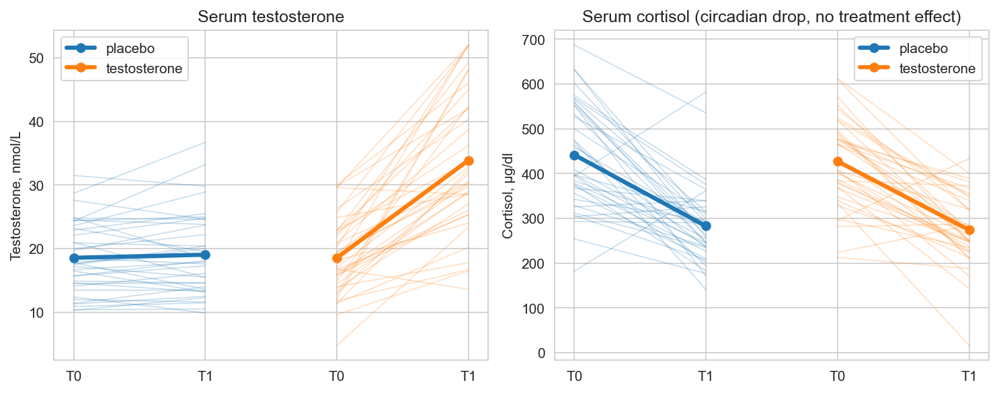

The individual *size* of the hormonal response varies a lot — which is exactly what the analysis
exploits. Rather than a dummy variable "gel vs placebo", the models use each person's measured
**relative change at the moment of choice**:

$$T_{change,i} = \frac{T^{(testosterone)}_{1,i} - T^{(placebo)}_{1,i}}{T^{(placebo)}_{1,i}}.$$

*Figure CS.2 — Distribution of $T_{change}$ across participants (paper Fig. 2): a nearly 3-fold
range, from ≈ 0 % to ≈ +270 %.*

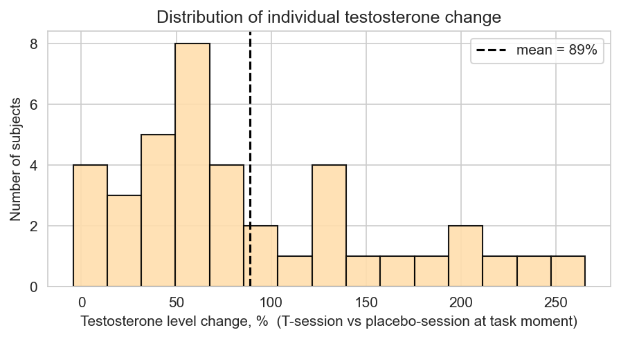

```{admonition} Modeling lesson — use the dose you actually got
:class: tip
A treatment indicator assumes every participant received the same effective dose. A measured
pharmacokinetic covariate like $T_{change}$ turns "treatment" into a *continuous, person-specific*
quantity and typically buys power and interpretability. The price: under placebo $T_{change}$ is 0
by construction, so the covariate encodes "how much more hormone was circulating while deciding".
```

**The games.** Five probability levels × two framings (amounts in EUR; Table 1 of the paper):

| Game | $p$(risky) | Pos: A (risky win) | Pos: B (sure win) | Neg: A (risky loss) | Neg: B (sure loss) |
|------|-----------|--------------------|-------------------|---------------------|--------------------|
| 5 | 0.9 | 2,000 | 1,500 | 2,400 | 1,200 |
| 4 | 0.7 | 500 | 250 | 600 | 200 |
| 3 | 0.5 | 1,000 | 500 | 1,000 | 500 |
| 2 | 0.3 | 500 | 250 | 1,800 | 600 |
| 1 | 0.1 | 250 | 50 | 1,200 | 400 |

*Figure CS.3 — Objective expected-value differences vs observed risky-choice rates. Left: positive
framing. Right: negative framing. Note the dissociation: game 1 in the gain domain offers a huge
objective edge (+€25 expected) yet people choose the gamble barely above half the time — subjective
value is not expected value.*

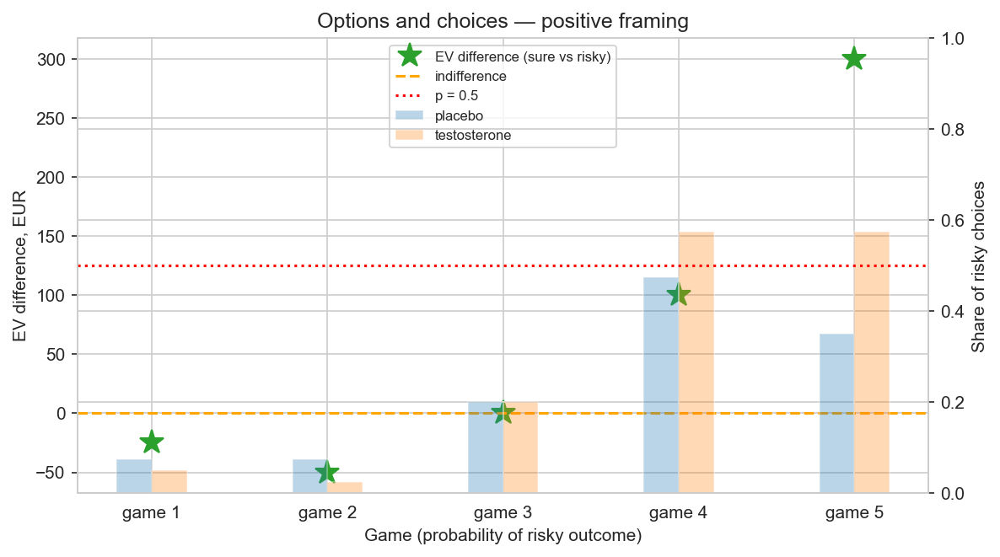

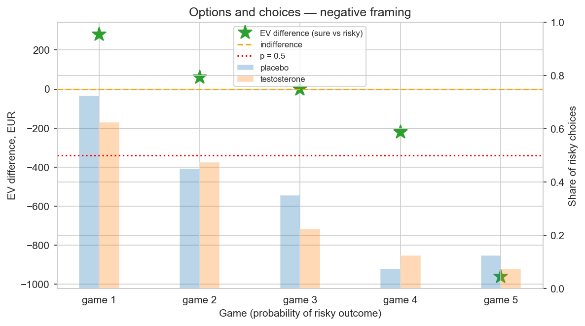

---

## 3. Turning a theory into a regressor: CPT inside a GLM

The elegant trick of this paper is that **cumulative prospect theory (CPT)** is not fitted as a
monolithic process model — it is compressed into a single theory-driven regressor that feeds an
ordinary hierarchical logistic regression. Two functions do all the work
{cite}`tversky1992,nilsson2011`:

**Value function** (diminishing sensitivity to money):

$$v(x) = \operatorname{sign}(x)\,|x|^{\alpha}$$

**Probability weighting** (inverse-S distortion of probabilities):

$$\omega(p) = \frac{p^{c}}{\left(p^{c} + (1-p)^{c}\right)^{1/c}}$$

*Figure CS.4 — The two CPT components with the parameters used in the study. Left: value functions
for $\alpha = 0.67$ (gains) and $\alpha = 0.96$ (losses). Right: weighting functions for
$c = 0.82$ and $c = 0.87$ vs the identity.*

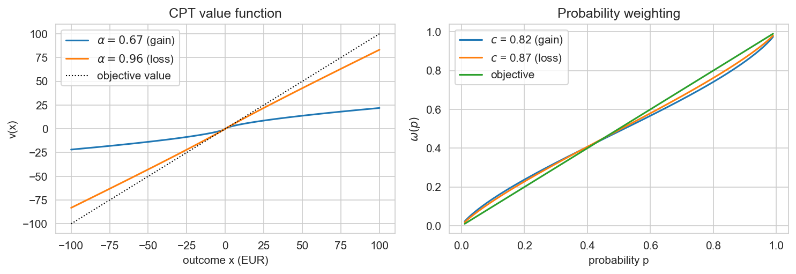

The risky option A and sure option B of each game then receive subjective values

$$V(A) = v(x_A)\,\omega(p), \qquad V(B) = v(x_B),$$

and their difference — the **gap** — measures how much better one option *feels*:

$$\mathrm{gap} = V(A) - V(B).$$

One practical wrinkle: the games span €50–€2,400, so raw gaps are enormous compared to the ~$10
scale of the classic CPT literature, which would crush the logistic slope. The paper applies a
signed log transform,

$$\mathrm{logGap} = \operatorname{sign}(\mathrm{gap})\,\log\!\big(1 + |\mathrm{gap}|\big),$$

which leaves small differences almost untouched ($\log(1+x) \approx x$) while compressing large ones.

*Figure CS.5 — The subjective gap per game for three candidate $c$ values, with observed
risky-choice rates (bars). The ordering of games by subjective attractiveness depends on $c$ — in
the gain domain a low $c$ even reverses the ranking of games 2 and 3 (paper Fig. 4).*

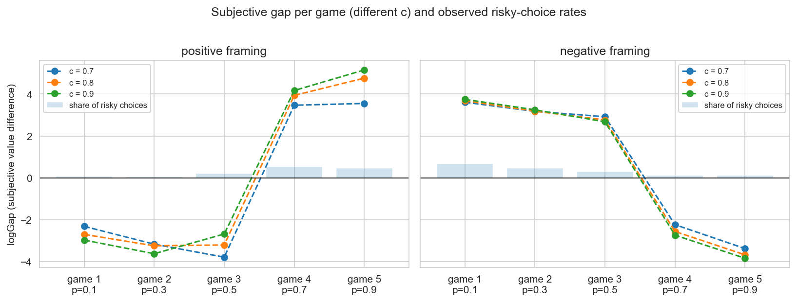

### 3.1 Where do α and c come from? Borrowing strength from open data

Five games per framing cannot identify two curvature parameters per framing on top of everything
else. Instead of giving up, the authors **re-estimated CPT on someone else's open data** — the
Rieskamp experiment republished by @nilsson2011 (30 participants, 120 pure-gain and pure-loss
games; OSF `sbxm2`) — using the same log-transformed gap. The resulting values,

$$\alpha_{Loss},\, \alpha_{Gain} = 0.96,\ 0.67, \qquad c_{Loss},\, c_{Gain} = 0.87,\ 0.82,$$

are then treated as **fixed inputs** to the choice model.

*Figure CS.6 — Sanity check of the replication data: mean choice frequency tracks the log-gap of the
two options, in both domains.*

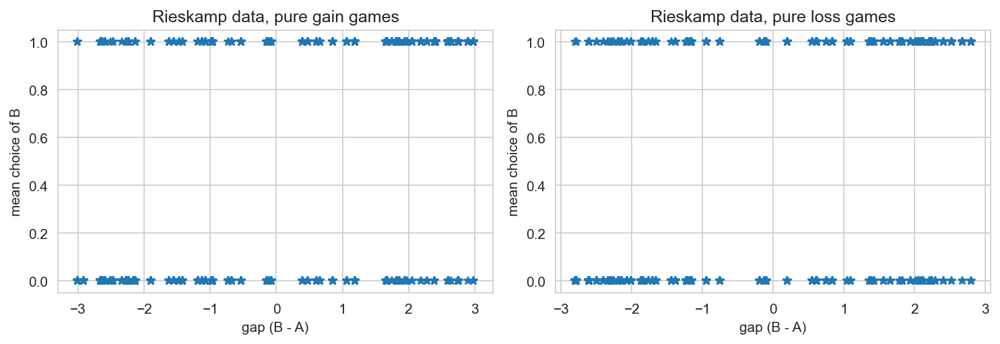

The notebook's §4.1 re-estimates a pooled version of this replication in PyMC 5 and recovers the
same region ($\hat\alpha_{Gain}\approx 0.71$, $\hat\alpha_{Loss}\approx 1.0$,
$\hat c \approx 0.78$), and §5.6 re-runs the main model with these re-estimated values as a
robustness check — the conclusions do not move.

```{admonition} Modeling lesson — fixed or random?
:class: caution
"Estimate everything jointly" is not always the best move. When a submodel is weakly identified by
your design (5 trials per cell), anchoring it to a larger, compatible dataset — and *checking*
sensitivity to that anchor — is a defensible and transparent alternative. What would be wrong is to
anchor silently.
```

---

## 4. The choice model

All model variants share the likelihood

$$y_i \sim \operatorname{Bernoulli}(\theta_i), \qquad
\operatorname{logit}(\theta_i) = A_{F[i]} + B_{F[i]}\cdot \mathrm{logGap}_i,$$

where $F[i] \in \{\text{Loss}, \text{Gain}\}$ is the framing of trial $i$. The two framing-specific
coefficients have clean psychological names:

* **Shift** $a_F$ — the tendency to prefer the *sure* option when the two options are subjectively
  equal ($\mathrm{logGap}=0$). A negative shift = "when in doubt, don't gamble" (loss aversion
  leaking into the intercept).
* **Sensitivity** $b_F$ — how strongly choices follow the subjective value difference.

The hormonal modulation is a regression *on the coefficients themselves*:

$$A_{F} = a_{F} + \delta^{a}_{F}\, T_{change}, \qquad B_{F} = b_{F} + \delta^{b}_{F}\, T_{change}.$$

The four $\delta$'s answer the paper's Q1:

| Parameter | Reads as |
|---|---|
| $\delta^{a}_{Gain} > 0$ | testosterone → more willing to gamble on equal-value gains |
| $\delta^{b}_{Gain} > 0$ | testosterone → choices follow gain differences *more* strongly |
| $\delta^{a}_{Loss} < 0$ | testosterone → stronger retreat to the sure option in losses |
| $\delta^{b}_{Loss}$ | testosterone → sensitivity to loss differences |

### 4.1 The model zoo

Because every participant contributed choices in both framings and both sessions, the shift and
sensitivity parameters of the same person are correlated — someone cautious in gains is plausibly
cautious in losses. The paper's winning model therefore gives each subject a 4-vector of deviations
$(\Delta a_N, \Delta b_N, \Delta a_P, \Delta b_P)$ with a full covariance matrix:

$$\begin{pmatrix}\Delta a_N \\ \Delta b_N \\ \Delta a_P \\ \Delta b_P\end{pmatrix}_j
\sim \mathcal{N}(\mathbf 0, \Sigma), \qquad
\Sigma = \operatorname{diag}(\sigma)\, L\, L^{\top} \operatorname{diag}(\sigma),$$

with the LKJ(2) prior on the correlation matrix — in PyMC one line:

```python
chol, corr, stds = pm.LKJCholeskyCov("chol", n=4, eta=2,
                                     sd_dist=pm.Exponential.dist(1.0), compute_corr=True)
z = pm.Normal("z_inds", 0, 1, dims=("params", "PId"))
ab = pm.Deterministic("ab_inds", pt.dot(chol, z), dims=("params", "PId"))
```

The `z`-trick is the **non-centered parameterization**: the sampler explores independent standard
normals, and the Cholesky factor does the geometry. (The original 2022 code used a *centered*
multivariate normal; §11 lists this among the fixes.)

| Model | Varying effects | Covariance | Testosterone |
|---|---|---|---|
| M0 | none (pooled) | – | – |
| M1 | none (pooled) | – | ✓ |
| M2 | per-subject shift & beta | independent | ✓ |
| **M3** | per-subject 4-vector | **LKJ** | ✓ |

---

## 5. Estimation, checking, comparison

The notebook samples all four models (4 chains × 1,500 draws after 1,500 tuning steps;
$\hat R < 1.01$, no divergences). Two complementary quality checks:

1. **Predictive accuracy by game** (posterior predictive calibration) and
2. **Information criteria** (WAIC, as in the paper; PSIS-LOO as a modern companion).

*Figure CS.7 — Posterior predictive check of the winning model M3: observed vs predicted rate of
risky choices for each of the 20 game × condition cells (94% intervals). Points hug the diagonal
(ROC-AUC = 0.94).*

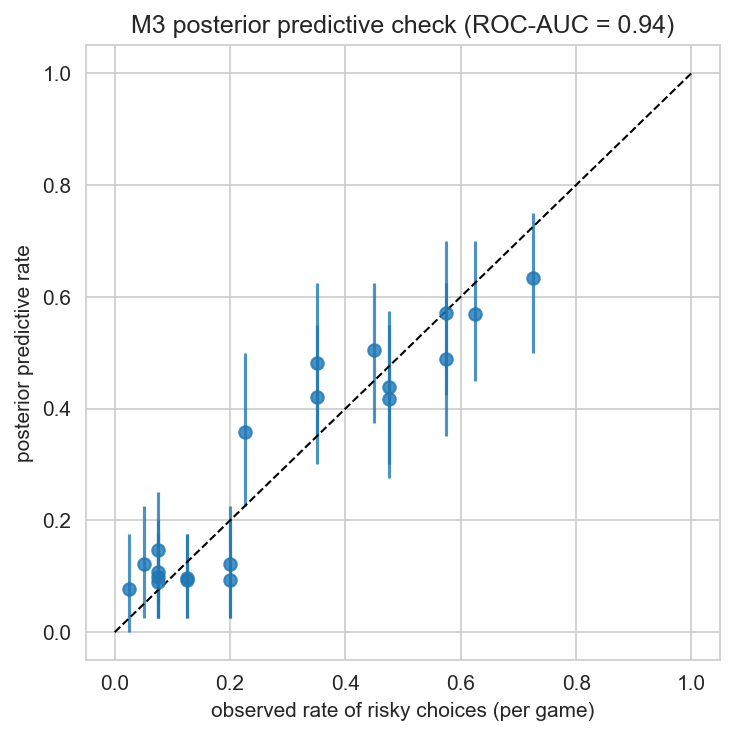

| Model | ROC-AUC | elpd_waic | rank (LOO) |
|---|---|---|---|
| M0 pooled | 0.77 | −408.2 | 4 |
| M1 pooled + T | 0.77 | −407.8 | 3 |
| M2 hierarchical | 0.94 | −319.2 | 2 |
| **M3 hierarchical + cov** | **0.94** | **−314.4** | **1** |

Hierarchical structure — not the testosterone terms — drives most of the jump in fit: people differ,
and partial pooling lets the model use that. Testosterone terms add a smaller, but real, improvement.

---

## 6. Results: what testosterone does to risky choice

*Figure CS.8 — Posterior distributions of the four testosterone-related coefficients (94% HDIs,
reference line at zero). Top: shifts. Bottom: sensitivities. Left: negative framing. Right: positive
framing. (Paper Fig. 5 / Table 2.)*

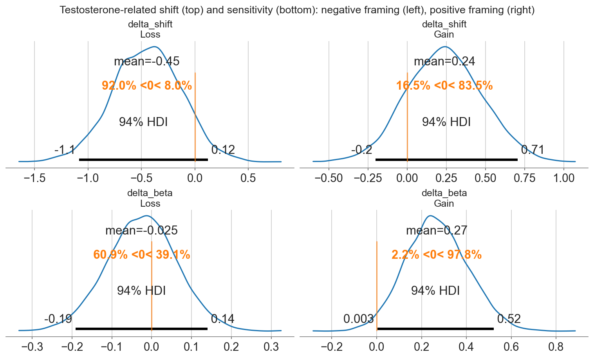

Reproduced posterior (this re-analysis ≈ paper Table 2):

| Parameter | mean | sd | 94% HDI | odds |
|---|---|---|---|---|
| shift (negative framing) | −2.08 | 0.49 | [−3.04, −1.19] | 0.12 |
| shift (positive framing) | −0.98 | 0.32 | [−1.59, −0.39] | 0.38 |
| beta (negative framing) | 0.62 | 0.14 | [0.37, 0.90] | 1.86 |
| beta (positive framing) | 0.64 | 0.12 | [0.42, 0.88] | 1.90 |
| delta shift (negative) | −0.45 | 0.32 | [−1.08, 0.12] | 0.64 |
| delta shift (positive) | +0.24 | 0.24 | [−0.20, 0.71] | 1.27 |
| delta beta (negative) | −0.02 | 0.09 | [−0.19, 0.14] | 0.98 |
| **delta beta (positive)** | **+0.27** | **0.14** | **[+0.00, +0.52]** | **1.31** |

Reading:

1. **People are sure-option biased**, massively so in the loss domain (−2.1 vs −1.0 on the logit
   scale) — a direct imprint of loss aversion.
2. **Choices track subjective value** ($\beta \approx 0.63$ in both framings): the CPT regressor is
   doing real work.
3. **The headline effect**: under positive framing, testosterone *increases sensitivity to gains*
   ($\delta\beta_{Gain} = +0.27$, 94% HDI [+0.00, +0.52] excludes 0; odds ≈ 1.3 per unit of
   $T_{change}$). The paper reports this as a very large standardized effect.
4. Under negative framing the picture reverses direction — a shift *toward* the sure option
   ($\delta a_{Loss} = -0.45$, HDI includes 0 but most mass is negative). Testosterone did not
   simply make people "braver": it bent the value function differently in the two domains — more
   gain-seeking **and** (weakly) more loss-avoidant.

### 6.1 Counterfactual predictions

Posterior in hand, we can ask the model forward questions the experiment never ran:
fix the subjective stake at three levels and sweep testosterone.

*Figure CS.9 — Model-implied probability of choosing the risky option as a function of relative
testosterone change, for small / medium / large value differences. Bands: 50% posterior intervals
(paper Fig. 6).*


*Figure CS.10 — The complementary slice: risk propensity vs stake size at three fixed testosterone
levels (paper Fig. 7).*

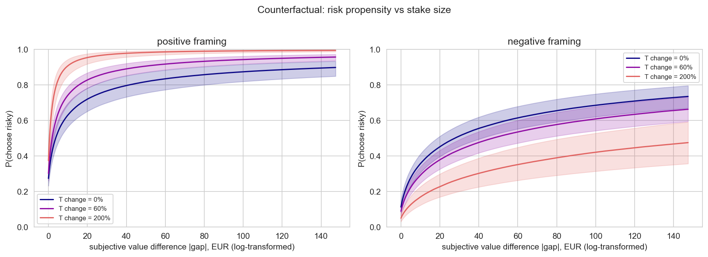

Under gains, more testosterone tilts choices toward the gamble — most visibly at small and medium
stakes, exactly where the logistic is most responsive. Under losses, higher testosterone flattens
risk-taking. Note how different this is from the naive summary "testosterone increases risk-taking":
the sign of the effect *depends on the framing and the stake*, which is why a parameterized model
beats a t-test on choices.

*Figure CS.11 — Posterior mean correlations between the four subject-level parameters (M3). The
off-diagonal structure is what the LKJ layer buys: e.g. subjects more sure-biased in losses tend to
be less gain-sensitive.*

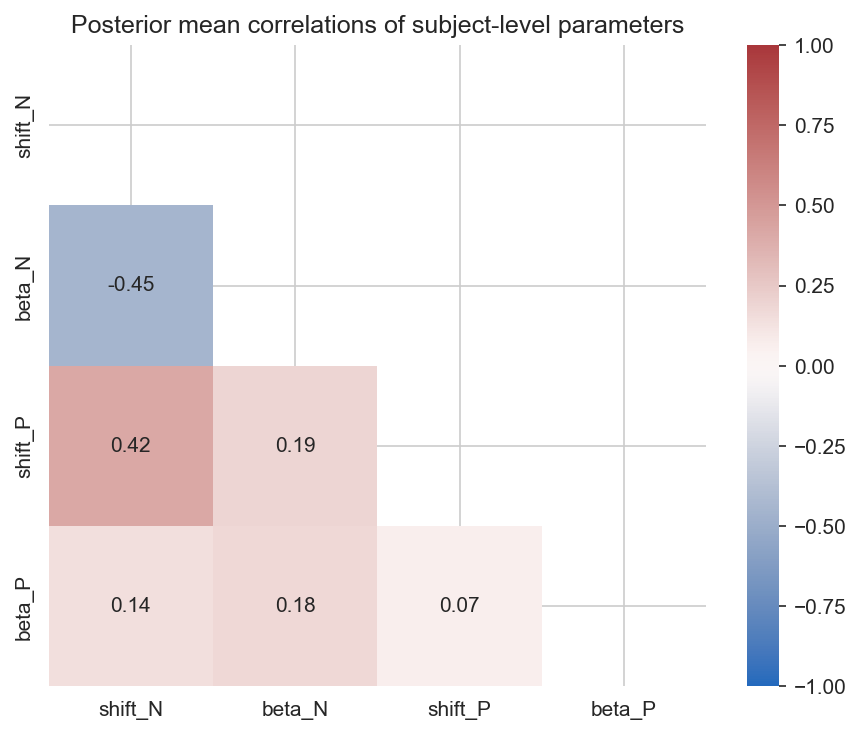

---

## 7. The endowment effect

Moving from choices to prices: for every item × participant × session we observe WTA (selling) and
WTP (buying) prices. The outcome is the ratio $\mathrm{WTA}/\mathrm{WTP}$ — positive, right-skewed,
with a natural reference value of 1 ("no endowment effect"). The paper's model (Methods) is a
lognormal hierarchical regression — equivalently, a Gaussian model of the log-ratio:

$$\mathrm{WTA/WTP}_{i} \sim \operatorname{LogNormal}(\mu_i, \sigma), \qquad
\mu_i = \mu_0 + g_{\text{item}[i]} + u_{\text{subj}[i]} + b\,T_{change,i}$$

with varying intercepts for the 28 items ($g$) and 38 subjects ($u$). The posterior of
$\exp(\mu_0 + g_{\text{item}})$ is the per-item endowment ratio.

```{admonition} Fix vs the 2022 code
:class: warning
The published *paper* describes exactly the lognormal model above, but the released PyMC3 code
actually fitted the **raw** ratio with a Normal likelihood, clipped
outliers at mean + 3 SD, and bolted together two half-Cauchy scale parameters per observation.
The re-analysis implements the specification the paper describes: cleaner, no clipping needed
(the log already tames the right tail), and with non-centered varying effects.
```

*Figure CS.12 — Posterior WTA/WTP ratio per item (94% HDIs), orange = hedonic, blue = utilitarian.
14 of 28 items are individually credibly above 1 ($P(\text{ratio}>1) > 0.95$), and the category-level
ratios are both credibly above 1 — partial pooling shrinks noisy items toward the grand mean rather
than letting them explode (paper Fig. 8).*

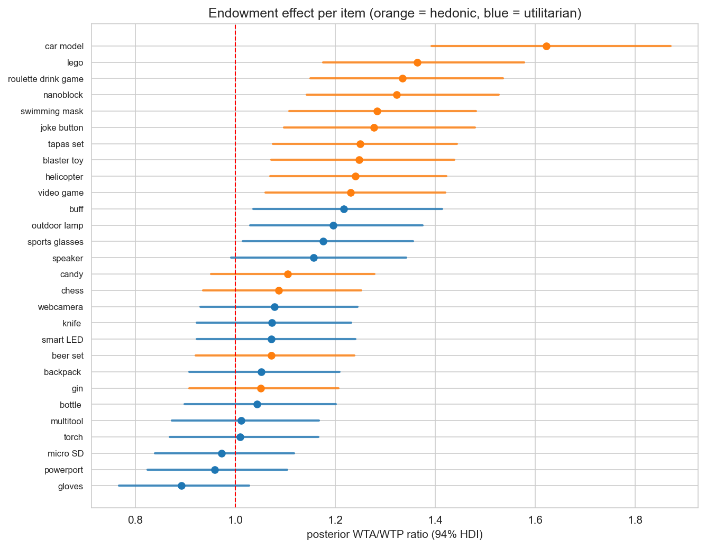

*Figure CS.13 — Category-level posteriors. Left/middle: WTA/WTP by category. Right: the
hedonic/utilitarian ratio-of-ratios (reference line 1). Hedonic goods show a ~1.27 endowment ratio
vs ~1.08 for utilitarian ones; $P(\text{hedonic} > \text{utilitarian}) \approx 1$ (paper Fig. 9).*

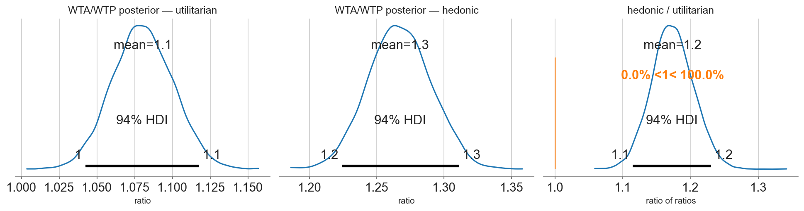

**Q3 — testosterone?** The global slope is $b \approx 0.04$ log-units per unit $T_{change}$
(94% HDI [0.001, 0.075]): at the median hormonal change (+69 %) this multiplies the ratio by
$\approx 1.03$ — three percent. The per-item analysis (partial pooling of item-level slopes) shows
**not a single item** whose 95% HDI excludes zero:

*Figure CS.14 — Item-level testosterone slopes in log(WTA/WTP) with 95% HDIs (paper Fig. 10).
All intervals straddle zero.*

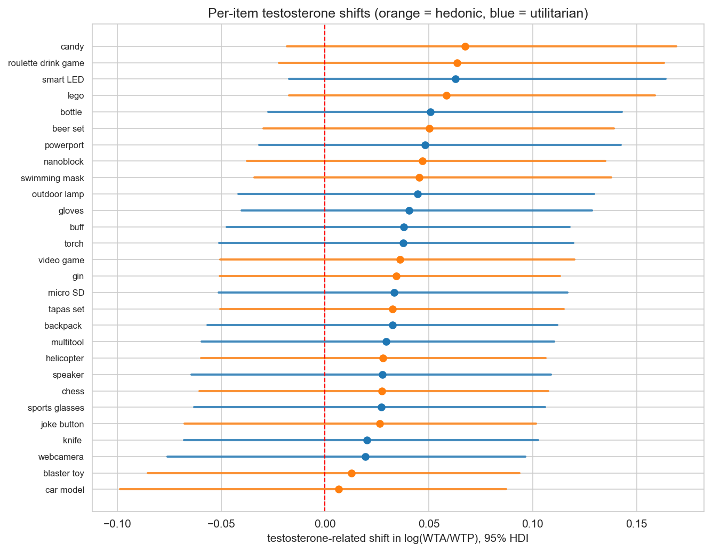

```{admonition} How to report a borderline interval
:class: tip
The global interval *just* excludes zero while nothing survives at the item level and the effect
size is ~3 %. A defensible scientific summary is: "no meaningful testosterone effect on the
endowment effect; the data are also not precise enough to rule out a tiny positive one." Binary
"significant / not significant" language would lose information in both directions.
```

---

## 8. Conclusions of the case study

1. **Testosterone is not a general "risk hormone".** It increased gain-sensitivity under positive
   framing (94% HDI excluding 0) while nudging choices toward the sure option under negative
   framing — a *domain-specific* modulation, consistent with a hormone acting on valuation circuitry
   rather than on a global "bravery" dial.
2. **The endowment effect is robust** (category-level ratios credibly above 1, geometric mean
   ≈ 1.14, 14 of 28 items individually credible) and **stronger for hedonic than utilitarian
   goods** (≈ 1.27 vs ≈ 1.08) — but **unaffected by testosterone** in any practically meaningful
   way.
3. **Mechanistic regressors beat treatment dummies.** Using CPT to convert the task into
   shift/sensitivity parameters, and the measured hormonal change as the covariate, yields
   interpretable, comparable, and predictive quantities — the model's ROC-AUC is 0.94 (0.77 for
   the pooled baseline).

---

## 9. The Bayesian workflow, as rehearsed here

| Workflow stage | Where it happened |
|---|---|
| Ground the estimand in theory | §3: CPT → logGap regressor |
| Use all information, transparently | §3.1: α, c anchored to open replication data; §5/§5.6 sensitivity re-run |
| Build a model zoo, not One Model | §4.1: M0 → M3 |
| Prior choice on transformed parameters | probit/log mappings keep α, c, φ in valid ranges with unconstrained samplers |
| Non-centered geometry | subject effects via `z`-scales and `LKJCholeskyCov` |
| Convergence diagnostics | $\hat R$, ESS, divergence counts per model |
| Posterior predictive checks | per-game calibration (Fig. CS.7) |
| Predictive model comparison | WAIC (paper) + PSIS-LOO (here) |
| Decision-relevant summaries | odds ratios, $P(\cdot)$ statements, per-item HDIs |
| Robustness | re-run with re-estimated α, c (§5.6 of the notebook) |

---

## 10. Exercises

1. **Prior predictive check.** Simulate choices from M3's priors (hint: `pm.sample_prior_predictive`).
   What fraction of prior-predictive choice probabilities are extreme (< 0.05 or > 0.95)? Are the
   priors on `shift`/`beta` reasonable for this task?
2. **Centered vs non-centered.** Revert M2's subject effects to the centered form
   (`pm.Normal("shift_ind", shift[gt], sigma_shift, ...)`). Compare divergences, ESS and posterior
   means. What do you observe?
3. **Estimate α jointly.** Move `ALPHAS` into the model with the probit-mapped prior from §4.1 (one
   α per framing). Does the posterior of $\delta\beta_{Gain}$ widen? Why?
4. **Add cortisol.** $T_{change}$ has a cortisol analogue in `horm_sort.csv`. Add a
   cortisol-by-framing term to the choice rule. Does it compete with or complement the testosterone
   effect?
5. **Endowment categories as hierarchy.** Replace the item-level intercepts `g_item` in E1 by a
   two-level hierarchy ($g_{\text{item}} \sim \mathcal{N}(\mu_{\text{type}[i]}, \tau)$). Compare the
   category-level posteriors with the compact E2 model.
6. **Sequential analysis.** Imagine recruiting participants one at a time. Using the posterior as
   the next prior, at which $N$ would the $\delta\beta_{Gain}$ interval first exclude zero?

---

## 11. What changed vs the 2022 implementation (PyMC3 → PyMC 5)

| # | Original (2022) | This re-analysis | Why |
|---|---|---|---|
| 1 | `theano.tensor` (`tt`) | `pytensor.tensor` (`pt`), `pt.sign` etc. | Theano is unmaintained; PyMC 5 runs on Pytensor |
| 2 | `pm.Binomial(n=1, ...)` | `pm.Bernoulli` | clearer intent |
| 3 | `trace` + `az.from_pymc3` plumbing | `pm.sample` returns `InferenceData` directly, `log_likelihood` on demand | modern API |
| 4 | `az.summary(..., credible_interval=)` | `hdi_prob=` | renamed in ArviZ |
| 5 | centered multivariate subject effects | non-centered (`z` + Cholesky dot) | removes funnel pathologies, ~0 divergences |
| 6 | `init='advi'`, long runs | default NUTS init, 4×1500 draws ≈ 15–60 s per model | sampler improvements |
| 7 | endowment: Normal on raw ratio + outlier clipping + half-Cauchy sums | lognormal likelihood per the paper's Methods | correctness & stability |
| 8 | WAIC only | PSIS-LOO added | modern default, Pareto-k diagnostics |
| 9 | fixed α, c from a separate PyMC3 notebook | α, c re-estimated in-notebook + robustness re-run of M3 | self-contained, sensitivity explicit |
| 10 | ROC-AUC from hand-assembled PPC arrays | posterior `theta` Deterministic | less plumbing, same numbers |

**Verification.** The re-analysis reproduces the paper's Table 2 to within Monte-Carlo error (e.g.
$\delta\beta_{Gain}$: +0.27 [0.00, 0.52] here vs +0.27 [0.01, 0.52] published; the original saved
posteriors agree exactly with the new pipeline on all inputs — choices, gaps, hormonal covariate).

---

## 12. References

```{bibliography}
:filter: docname in docnames
```

* Votinov, M., Knyazeva, I., Habel, U., Konrad, K., & Puiu, A. A. (2022). A Bayesian modeling
  approach to examine the role of testosterone administration on the endowment effect and
  risk-taking. *Frontiers in Neuroscience, 16*, 858168.
* Nilsson, H., Rieskamp, J., & Wagenmakers, E.-J. (2011). Hierarchical Bayesian parameter estimation
  for cumulative prospect theory. *Journal of Mathematical Psychology, 55*(1), 84–93.
* Tversky, A., & Kahneman, D. (1992). Advances in prospect theory: Cumulative representation of
  uncertainty. *Journal of Risk and Uncertainty, 5*, 297–323.
* Kahneman, D., Knetsch, J. L., & Thaler, R. H. (1991). Anomalies: The endowment effect, loss
  aversion, and status quo bias. *Journal of Economic Perspectives, 5*(1), 193–206.
* Thaler, R. (1980). Toward a positive theory of consumer choice. *Journal of Economic Behavior &
  Organization, 1*(1), 39–60.
* McElreath, R. (2020). *Statistical Rethinking: A Bayesian Course with Examples in R and Stan*
  (2nd ed.). CRC Press.
* Ruggeri, K., et al. (2020). Replicating patterns of prospect theory for decision under risk.
  *Nature Human Behaviour, 4*, 622–633.

**Data & original code:** `github.com/iknyazeva/RiskTestosterone`; Rieskamp/Nilsson data:
OSF `sbxm2`.
